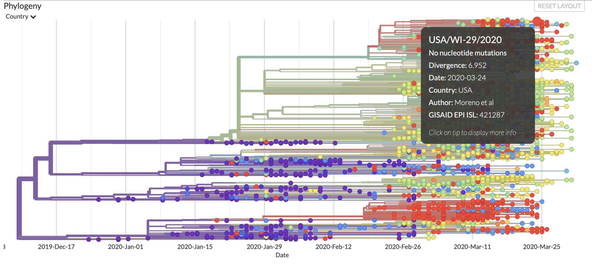

[GISAID](https://www.gisaid.org/)
======

GISAID stands for the *Global Initiative on Sharing All Influenza Data*. This source offers a database, EpiFlu, full of genome sequence datasets contributed from labs from around the world. GISAID also offers visualization tools which highlight the progression of hCoV-19 in terms of nucleotide and amino acid mutations. 

[Folding@Home](https://foldingathome.org/)
======

Folding@Home is program at Washington University in St. Louis which utilizes computing power from around the world to run protien simulations. The term *folding* in their name is in reference to the folding behavior of protiens. Folding@Home runs these protien simulations in an effort to discover theraputics for cancer as well as neurological and infectious diseases. Their software allows anyone with a modern computer to offer their computing resources for Folding@Home's simulations. 

[Next Strain](https://nextstrain.org/ncov)
======

Next Strain describe themseleves as, "an open-source project to harness the scientific and public health potential of pathogen genome data." They provide visualizations and analysis for the "real-time snapshot of evolving pathogen populations." They utilize open source software to generate their visualizations and analysis and provide a significant amount of documentation explaining the software in-depth and common useage patterns.

[Galaxy](https://covid19.galaxyproject.org/)
======

Galaxy describes themselves as, "an open, web-based platform for accessible, reproducible, and transparent computational research." The Galaxy platform is developed by their team and the worldwide community who utilizes it. They emphasize their goal of enabling reproducible research in life sciences, however, their software has applications far beyond just life sciences.
