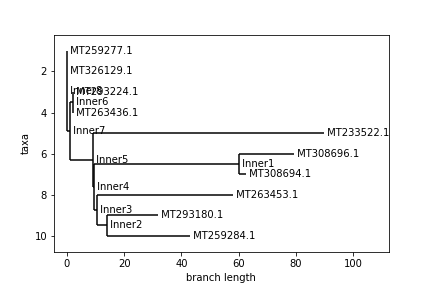
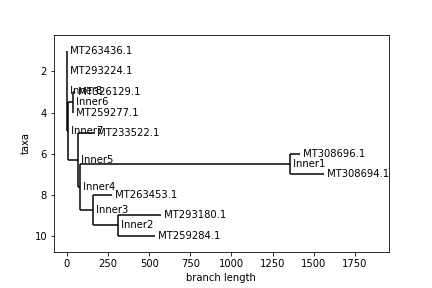

# COVID-19 Summary Page
This page will serve as my collection of COVID-19 information and data analysis
over the course of the next several weeks.

# Project 1
This week, our assignment was to investigate and summarize the links below.

### The GISAID Initiative
[https://www.gisaid.org/](https://www.gisaid.org/)

From their website:
> The GISAID Initiative promotes the international sharing of all influenza virus sequences, related clinical and epidemiological data associated with human viruses, and geographical as well as species-specific data associated with avian and other animal viruses, to help researchers understand how the viruses evolve, spread and potentially become pandemics.

In short, The GISAID Initiative allows biologists from around the world to upload genome sequences.  This is particularly relevant for the coronavirus, where there has been an unprecented amount of sequences submitted.

Something particularly interesting on the site is [this graph](https://www.gisaid.org/epiflu-applications/next-hcov-19-app/), which displays how the genome of the virus, has changed over time and location.

### Folding@Home
[https://foldingathome.org/](https://foldingathome.org/)

From their website:
> Folding@home (FAH or F@h) is a distributed computing project for simulating protein dynamics, including the process of protein folding and the movements of proteins implicated in a variety of diseases. It brings together citizen scientists who volunteer to run simulations of protein dynamics on their personal computers. Insights from this data are helping scientists to better understand biology, and providing new opportunities for developing therapeutics.

In short, Folding@Home allows people from all over the world "donate" their computing power when they aren't using it so that biologists can run simulations on them.  The simulations that are focused on are folding proteins to be able to identify their structure.  Currently, the team is starting simulations of COVID-19 proteins, which can hopefully be used in the future for finding a cure.

### Nextstrain
[https://nextstrain.org/ncov](https://nextstrain.org/ncov)

From their website:
> Nextstrain is an open-source project to harness the scientific and public health potential of pathogen genome data. We provide a continually-updated view of publicly available data alongside powerful analytic and visualization tools for use by the community. Our goal is to aid epidemiological understanding and improve outbreak response. If you have any questions, or simply want to say hi, please give us a shout at hello@nextstrain.org.

In short, Nextstrain provides real-time graphing of pathogen evolution.  The above link leads to a web application that, using the data from GISAID (mentioned above), shows how the virus spread from one country to another over time.

### Specific Case Data
[https://mra.asm.org/content/9/11/e00169-20](https://mra.asm.org/content/9/11/e00169-20)

ASM is one of the largest life science societies in the world.  The above link goes to a publication in the ASM journals, which details how a specific Nepalese patient contracted Coronavirus and was tested.  The paper goes in-depth on how the test was conducted, how different mutations/strains of the virus occur, and how the virus is structured.  It is also accompanied by the genomic data acquired.

### Galaxy Project
[https://covid19.galaxyproject.org/](https://covid19.galaxyproject.org/)

From their website:
> Galaxy is an open, web-based platform for accessible, reproducible, and transparent computational research.

Specifically, the above link goes to the COVID-19 hub, which has the description:
> The goal of this resource is to provide publicly accessible infrastructure and workflows for SARS-CoV-2 data analyses. We currently feature three different types of analyses: Genomics, Evolution, and Cheminformatics.

In short, the Galaxy Project is a hub for people all around the world to perform open-sourced scientific research.  This includes people like us doing COVID-19 research from home!  There are many resources on this site for getting Coronavirus data, tutorials on how to analyze said data, etc.

---
# Project 2
This week, I decided to investigate one part of Dr. Anderson's example to see if it could be improved.  I specifically wanted to try another method of obtaining distances between sequences and compare it to the results that he obtained in his example.

### Levenshtein distance
From [Wikipedia](https://en.wikipedia.org/wiki/Levenshtein_distance):
> In information theory, linguistics and computer science, the Levenshtein distance is a string metric for measuring the difference between two sequences. Informally, the Levenshtein distance between two words is the minimum number of single-character edits (insertions, deletions or substitutions) required to change one word into the other.


In short, the Levenshtein distance is a way to measure the difference between two strings, so it is commonly used as a way to compare genomic sequences.  What is interesting about Levenshtein distance is that it handles misaligned sequences very well.  The metric takes into account if bases have been mutated, like the simple comparison of two aligned sequences matching or not, but also if bases have been inserted or deleted.  Because of this, it is a considerable upgrade to simply trying to align two sequences of different length and counting how many bases they have in common.

My goal was to replicate Dr. Anderson's example using the Levenshtein distances between sequences, then see if my results were very different from his.

Since the sequence strings do not need to be aligned for the Levenshtein distance to be applied, I pulled [the original data that Dr. Anderson used](https://covid19.galaxyproject.org/genomics/4-Variation/current_complete_ncov_genomes.fasta) and put it into a table, as shown below:

```
from Bio.SeqIO.FastaIO import SimpleFastaParser

sequences_df = pd.DataFrame()
with open("current_complete_ncov_genomes.fasta") as input_file:
    ids = []
    sequences = []
    for line, sequence in SimpleFastaParser(input_file):
        ids.append(line.split(None, 1)[0])
        sequences.append(sequence)
sequences_df["id"] = ids
sequences_df["sequence"] = sequences
sequences_df = sequences_df.set_index("id")
```

A key decision that I made during this test was to compare the same 10 sequences that Dr. Anderson used.  The reason for this is so that I can compare my results with his.  That said, these 10 sequences may or may not be the most important to look at.  With more compute power, I could analyze all of the sequences in the dataset, but I had to subset them by some method for my computer to finish crunching.

Luckily, there is a Python package called [python-Levenshtein](https://pypi.org/project/python-Levenshtein/) (install with `pip install python-Levenshtein`) to do the calculation for us.

I closely replicated Dr. Anderson's methods to obtain the distance matrix and the corresponding phylogenetic tree:

```
lev_distances = {}
for i, seqid1 in enumerate(subset_seqs):
    lev_distances[seqid1,seqid1] = 0
    for j in range(i + 1, len(subset_seqs)):
        seqid2 = subset_seqs[j]
        lev_distances[seqid1, seqid2] = Levenshtein.distance(sequences_df.loc[seqid1]["sequence"], sequences_df.loc[seqid2]["sequence"])
        lev_distances[seqid2, seqid1] = lev_distances[seqid1, seqid2]
lev_distances = pd.Series(lev_distances).unstack()
```

Here is a comparison of the distance matrix differences between Dr. Anderson's distance metric and the Levenshtein metric (Anderson above, Levenshtein below):


The Levenshtein distance is on a different scale, so we can't really compare the magnitude of the numbers.  However, it is clear to see that a couple of distances grew or shrank significantly relative to the other ones.

Finally, here is a comparison of the phylogenetic trees created (Anderson above, Levenshtein below):




An interesting thing to note regarding these trees is that despite the distance matrices looking somewhat different, very similar trees were still constructed.  In both trees, every pair of neighboring leaves is the same.  Only the top 4 ids swapped places as far as the branching structure of the tree goes.  Again, the Levenshtein distance is on a different scale, so we can't compare distances between trees.  That said, the main difference between the trees is the relative branch length between certain nodes, most notably id MT233522.1.  I am not sure how the Biopython package constructs these trees, so I can't say why this difference occurred, but it is interesting to observe, nonetheless.

My main takeaway from this experiment is that despite different methods used, similar results were obtained.  In the future, I would like to analyze what the pros and cons of each method are to make an argument to use one or the other.  The Levenshtein distance is more computationally expensive than simply counting differences between two aligned sequences, but the process of aligning the sequences may take even longer.  Obviously, this experiment is only a high-level observation of the differences.

---
# Project 3
This week, I figured out how to embed a Jupyter notebook, which makes it easier to present my thought process as it developed.  Please see <a href="https://nbviewer.jupyter.org/github/anderson-github-classroom/csc-448-project/blob/master/students/awengel/project3.ipynb">here</a>.