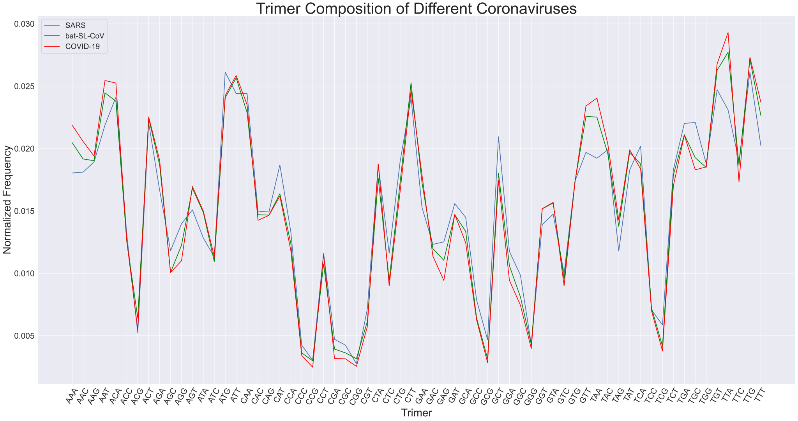
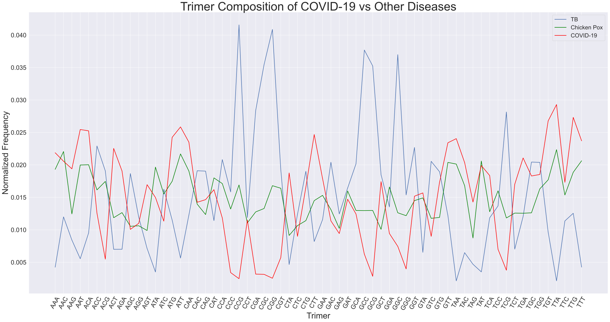

# Week 1: Link Discussion

## Overview
With little knowledge of bioinformatics this early in the quarter, this week is meant more to start looking at links and information on COVID-19.

---

## [The GISAID Initiative](https://www.gisaid.org/)
* GISAID (Global Initiative on Sharing ALl Influenza Data) is a nonprofit organization whose goal is to provide public access to genetic sequence data of influenza viruses.
* The database, named EpiFlu, is hosted by the German government and is mainly a German operation, but its services are intended for worldwide use.
* They allow public uploading of genetic sequences and share data.
* With the rise of COVID-19, they now have expanded to include data on the novel coronavirus.
* The website includes multiple graphics analyzing the data submitted for various genome sequences of COVID-19, provided by Nextstrain.
* The EpiFlu database might be a useful resource for acquiring real time data.

---

## [Folding@Home](https://foldingathome.org/)
* The "Folding" refers to the folding of proteins.
* By having people volunteer personal computing power, the project is about running simulations of protein dynamics to better understand various biological processes.
* Viruses have proteins that are used to suppress our immune systems as well as reproducing themselves.
* Folding@Home is trying to redirect its research towards COVID-19 and better understanding its protein structure.
* This can lead to discovering therapeutic techniques related to coronavirus.

---

## [Nextstrain](https://nextstrain.org/ncov/global)
* Nextstrain is an open source project that is meant to help track pathogen evolution using public health data.
* They have a lot of graphics on the evolution of COVID-19, using data from GISAID's EpiFlu database.
* Good visualization tool.

---

## [COVID-19 Analysis on usegalaxy](https://covid19.galaxyproject.org/)
* A helpful resource that has workflows to use for analysis of COVID-19.
* There are 3 different workflows for different types of analysis: Genomics, Evolution, and Cheminformatics.
* This can be helpful analyzing as a student since background knowledge is lacking/developing on bioinformatics.

---

# Week 2

# Week 2: Looking at Some Data

---

## Overview

Some guidance on what to take a look at:

* Consider what questions we want to ask from our evolutionary tree analysis. Think about what questions the book was trying to answer. Do we even have the data in this notebook to answer some of those questions? If not, spend time trying to find it now that you can know more about what to look for in terms of format. Do some literature searching and see what other work has been done for this virus and others.
* Research and try different evolutionary tree programs/frameworks. What I've done below is not the only game in town by far. Biopython itself has different options.
* Consider the alignment itself. Are there different ways to do this? Did we do it correctly?
* What about the sequences themselves? Are they all of the same quality? Should we exclude some?
* What about the virus alignment program? Did we use that correctly? Should we have done the entire sequence instead of using Spike as a reference? Should we try a different reference.
* Do we have more data available about the sequences? Part of world, etc. Can we do some digging here to answer different questions.
* And I'm sure you can think of more to attempt... Think about what you want to do. Spend time working towards a well thoughtout goal. Document things as you go. Talk to everyone on Slack. Together we can do this!

---

## Getting some Initial Data


```python
import wget

url = 'https://covid19.galaxyproject.org/genomics/4-Variation/current_complete_ncov_genomes.fasta'
file = 'data/current_complete_ncov_genomes.fasta'
#wget.download(url, file)
```

Getting an alignment (sequence MT350234.1 had an error):


```python
#!virulign ../../virulign/references/SARS-CoV-2/S.xml data/current_complete_ncov_genomes.fasta --exportAlphabet Nucleotides --exportKind PositionTable > data/position_table.csv
```

---

## Some Initial Work

### Read the Data into a pandas DataFrame


```python
import pandas as pd
position_table = pd.read_csv('data/position_table.csv')
results = position_table.describe()
display(position_table)
display(results)
```


<div>
<style scoped>
    .dataframe tbody tr th:only-of-type {
        vertical-align: middle;
    }

    .dataframe tbody tr th {
        vertical-align: top;
    }

    .dataframe thead th {
        text-align: right;
    }
</style>
<table border="1" class="dataframe">
  <thead>
    <tr style="text-align: right;">
      <th></th>
      <th>seqid</th>
      <th>S_1_1</th>
      <th>S_1_2</th>
      <th>S_1_3</th>
      <th>S_2_1</th>
      <th>S_2_2</th>
      <th>S_2_3</th>
      <th>S_3_1</th>
      <th>S_3_2</th>
      <th>S_3_3</th>
      <th>...</th>
      <th>S_1270_3</th>
      <th>S_1271_1</th>
      <th>S_1271_2</th>
      <th>S_1271_3</th>
      <th>S_1272_1</th>
      <th>S_1272_2</th>
      <th>S_1272_3</th>
      <th>S_1273_1</th>
      <th>S_1273_2</th>
      <th>S_1273_3</th>
    </tr>
  </thead>
  <tbody>
    <tr>
      <th>0</th>
      <td>MT007544.1</td>
      <td>A</td>
      <td>T</td>
      <td>G</td>
      <td>T</td>
      <td>T</td>
      <td>T</td>
      <td>G</td>
      <td>T</td>
      <td>T</td>
      <td>...</td>
      <td>A</td>
      <td>C</td>
      <td>A</td>
      <td>T</td>
      <td>T</td>
      <td>A</td>
      <td>C</td>
      <td>A</td>
      <td>C</td>
      <td>A</td>
    </tr>
    <tr>
      <th>1</th>
      <td>MT019529.1</td>
      <td>A</td>
      <td>T</td>
      <td>G</td>
      <td>T</td>
      <td>T</td>
      <td>T</td>
      <td>G</td>
      <td>T</td>
      <td>T</td>
      <td>...</td>
      <td>A</td>
      <td>C</td>
      <td>A</td>
      <td>T</td>
      <td>T</td>
      <td>A</td>
      <td>C</td>
      <td>A</td>
      <td>C</td>
      <td>A</td>
    </tr>
    <tr>
      <th>2</th>
      <td>MT019530.1</td>
      <td>A</td>
      <td>T</td>
      <td>G</td>
      <td>T</td>
      <td>T</td>
      <td>T</td>
      <td>G</td>
      <td>T</td>
      <td>T</td>
      <td>...</td>
      <td>A</td>
      <td>C</td>
      <td>A</td>
      <td>T</td>
      <td>T</td>
      <td>A</td>
      <td>C</td>
      <td>A</td>
      <td>C</td>
      <td>A</td>
    </tr>
    <tr>
      <th>3</th>
      <td>MT019531.1</td>
      <td>A</td>
      <td>T</td>
      <td>G</td>
      <td>T</td>
      <td>T</td>
      <td>T</td>
      <td>G</td>
      <td>T</td>
      <td>T</td>
      <td>...</td>
      <td>A</td>
      <td>C</td>
      <td>A</td>
      <td>T</td>
      <td>T</td>
      <td>A</td>
      <td>C</td>
      <td>A</td>
      <td>C</td>
      <td>A</td>
    </tr>
    <tr>
      <th>4</th>
      <td>MT019532.1</td>
      <td>A</td>
      <td>T</td>
      <td>G</td>
      <td>T</td>
      <td>T</td>
      <td>T</td>
      <td>G</td>
      <td>T</td>
      <td>T</td>
      <td>...</td>
      <td>A</td>
      <td>C</td>
      <td>A</td>
      <td>T</td>
      <td>T</td>
      <td>A</td>
      <td>C</td>
      <td>A</td>
      <td>C</td>
      <td>A</td>
    </tr>
    <tr>
      <th>...</th>
      <td>...</td>
      <td>...</td>
      <td>...</td>
      <td>...</td>
      <td>...</td>
      <td>...</td>
      <td>...</td>
      <td>...</td>
      <td>...</td>
      <td>...</td>
      <td>...</td>
      <td>...</td>
      <td>...</td>
      <td>...</td>
      <td>...</td>
      <td>...</td>
      <td>...</td>
      <td>...</td>
      <td>...</td>
      <td>...</td>
      <td>...</td>
    </tr>
    <tr>
      <th>815</th>
      <td>MT350277.1</td>
      <td>A</td>
      <td>T</td>
      <td>G</td>
      <td>T</td>
      <td>T</td>
      <td>T</td>
      <td>G</td>
      <td>T</td>
      <td>T</td>
      <td>...</td>
      <td>A</td>
      <td>C</td>
      <td>A</td>
      <td>T</td>
      <td>T</td>
      <td>A</td>
      <td>C</td>
      <td>A</td>
      <td>C</td>
      <td>A</td>
    </tr>
    <tr>
      <th>816</th>
      <td>MT350278.1</td>
      <td>A</td>
      <td>T</td>
      <td>G</td>
      <td>T</td>
      <td>T</td>
      <td>T</td>
      <td>G</td>
      <td>T</td>
      <td>T</td>
      <td>...</td>
      <td>A</td>
      <td>C</td>
      <td>A</td>
      <td>T</td>
      <td>T</td>
      <td>A</td>
      <td>C</td>
      <td>A</td>
      <td>C</td>
      <td>A</td>
    </tr>
    <tr>
      <th>817</th>
      <td>MT350279.1</td>
      <td>A</td>
      <td>T</td>
      <td>G</td>
      <td>T</td>
      <td>T</td>
      <td>T</td>
      <td>G</td>
      <td>T</td>
      <td>T</td>
      <td>...</td>
      <td>A</td>
      <td>C</td>
      <td>A</td>
      <td>T</td>
      <td>T</td>
      <td>A</td>
      <td>C</td>
      <td>A</td>
      <td>C</td>
      <td>A</td>
    </tr>
    <tr>
      <th>818</th>
      <td>MT350280.1</td>
      <td>A</td>
      <td>T</td>
      <td>G</td>
      <td>T</td>
      <td>T</td>
      <td>T</td>
      <td>G</td>
      <td>T</td>
      <td>T</td>
      <td>...</td>
      <td>A</td>
      <td>C</td>
      <td>A</td>
      <td>T</td>
      <td>T</td>
      <td>A</td>
      <td>C</td>
      <td>A</td>
      <td>C</td>
      <td>A</td>
    </tr>
    <tr>
      <th>819</th>
      <td>MT350282.1</td>
      <td>A</td>
      <td>T</td>
      <td>G</td>
      <td>T</td>
      <td>T</td>
      <td>T</td>
      <td>G</td>
      <td>T</td>
      <td>T</td>
      <td>...</td>
      <td>A</td>
      <td>C</td>
      <td>A</td>
      <td>T</td>
      <td>T</td>
      <td>A</td>
      <td>C</td>
      <td>A</td>
      <td>C</td>
      <td>A</td>
    </tr>
  </tbody>
</table>
<p>820 rows × 3820 columns</p>
</div>


<div>
<style scoped>
    .dataframe tbody tr th:only-of-type {
        vertical-align: middle;
    }

    .dataframe tbody tr th {
        vertical-align: top;
    }

    .dataframe thead th {
        text-align: right;
    }
</style>
<table border="1" class="dataframe">
  <thead>
    <tr style="text-align: right;">
      <th></th>
      <th>seqid</th>
      <th>S_1_1</th>
      <th>S_1_2</th>
      <th>S_1_3</th>
      <th>S_2_1</th>
      <th>S_2_2</th>
      <th>S_2_3</th>
      <th>S_3_1</th>
      <th>S_3_2</th>
      <th>S_3_3</th>
      <th>...</th>
      <th>S_1270_3</th>
      <th>S_1271_1</th>
      <th>S_1271_2</th>
      <th>S_1271_3</th>
      <th>S_1272_1</th>
      <th>S_1272_2</th>
      <th>S_1272_3</th>
      <th>S_1273_1</th>
      <th>S_1273_2</th>
      <th>S_1273_3</th>
    </tr>
  </thead>
  <tbody>
    <tr>
      <th>count</th>
      <td>820</td>
      <td>820</td>
      <td>820</td>
      <td>820</td>
      <td>820</td>
      <td>820</td>
      <td>820</td>
      <td>820</td>
      <td>820</td>
      <td>820</td>
      <td>...</td>
      <td>820</td>
      <td>820</td>
      <td>820</td>
      <td>820</td>
      <td>820</td>
      <td>820</td>
      <td>820</td>
      <td>820</td>
      <td>820</td>
      <td>820</td>
    </tr>
    <tr>
      <th>unique</th>
      <td>820</td>
      <td>1</td>
      <td>1</td>
      <td>1</td>
      <td>1</td>
      <td>1</td>
      <td>1</td>
      <td>1</td>
      <td>1</td>
      <td>1</td>
      <td>...</td>
      <td>1</td>
      <td>1</td>
      <td>1</td>
      <td>1</td>
      <td>1</td>
      <td>1</td>
      <td>1</td>
      <td>1</td>
      <td>1</td>
      <td>1</td>
    </tr>
    <tr>
      <th>top</th>
      <td>MT293188.1</td>
      <td>A</td>
      <td>T</td>
      <td>G</td>
      <td>T</td>
      <td>T</td>
      <td>T</td>
      <td>G</td>
      <td>T</td>
      <td>T</td>
      <td>...</td>
      <td>A</td>
      <td>C</td>
      <td>A</td>
      <td>T</td>
      <td>T</td>
      <td>A</td>
      <td>C</td>
      <td>A</td>
      <td>C</td>
      <td>A</td>
    </tr>
    <tr>
      <th>freq</th>
      <td>1</td>
      <td>820</td>
      <td>820</td>
      <td>820</td>
      <td>820</td>
      <td>820</td>
      <td>820</td>
      <td>820</td>
      <td>820</td>
      <td>820</td>
      <td>...</td>
      <td>820</td>
      <td>820</td>
      <td>820</td>
      <td>820</td>
      <td>820</td>
      <td>820</td>
      <td>820</td>
      <td>820</td>
      <td>820</td>
      <td>820</td>
    </tr>
  </tbody>
</table>
<p>4 rows × 3820 columns</p>
</div>


### Pull Out the Consensus Sequence

Consensus Sequence
: a sequence of DNA having similar structure and function in different organisms.


```python
consensus_seq = position_table.drop('seqid',axis=1).mode(axis=0).T[0]
display(consensus_seq)
position_table.set_index('seqid',inplace=True)
```


    S_1_1       A
    S_1_2       T
    S_1_3       G
    S_2_1       T
    S_2_2       T
               ..
    S_1272_2    A
    S_1272_3    C
    S_1273_1    A
    S_1273_2    C
    S_1273_3    A
    Name: 0, Length: 3819, dtype: object


---

## Utilizing Biopython for Initial Analysis

Determine which samples are farthest from the concensus sequence


```python
distance_from_consensus_seq = position_table.apply(lambda row: sum(row != consensus_seq),axis=1)
distance_from_consensus_seq_sorted = distance_from_consensus_seq.sort_values(ascending=False)
display(distance_from_consensus_seq_sorted)
```


    seqid
    MT345850.1    263
    MT345852.1    141
    MT345843.1    122
    MT345884.1     97
    MT233522.1     82
                 ... 
    MT263449.1      0
    MT263451.1      0
    MT263452.1      0
    MT263454.1      0
    MT263422.1      0
    Length: 820, dtype: int64


Select 10 sequences to do our first analysis


```python
subset_seqs = distance_from_consensus_seq_sorted[:10].index
display(subset_seqs)
```


    Index(['MT345850.1', 'MT345852.1', 'MT345843.1', 'MT345884.1', 'MT233522.1',
           'MT308696.1', 'MT308694.1', 'MT263453.1', 'MT259284.1', 'MT293180.1'],
          dtype='object', name='seqid')


Construct a distance matrix for the sequences


```python
distances = {}
for i,seqid1 in enumerate(subset_seqs):
    distances[seqid1,seqid1] = 0
    for j in range(i+1,len(subset_seqs)):
        seqid2 = subset_seqs[j]
        distances[seqid1,seqid2] = sum(position_table.loc[seqid1] != position_table.loc[seqid2])
        distances[seqid2,seqid1] = distances[seqid1,seqid2]
distances = pd.Series(distances).unstack()
display(distances)
```


<div>
<style scoped>
    .dataframe tbody tr th:only-of-type {
        vertical-align: middle;
    }

    .dataframe tbody tr th {
        vertical-align: top;
    }

    .dataframe thead th {
        text-align: right;
    }
</style>
<table border="1" class="dataframe">
  <thead>
    <tr style="text-align: right;">
      <th></th>
      <th>MT233522.1</th>
      <th>MT259284.1</th>
      <th>MT263453.1</th>
      <th>MT293180.1</th>
      <th>MT308694.1</th>
      <th>MT308696.1</th>
      <th>MT345843.1</th>
      <th>MT345850.1</th>
      <th>MT345852.1</th>
      <th>MT345884.1</th>
    </tr>
  </thead>
  <tbody>
    <tr>
      <th>MT233522.1</th>
      <td>0</td>
      <td>115</td>
      <td>130</td>
      <td>104</td>
      <td>135</td>
      <td>151</td>
      <td>202</td>
      <td>345</td>
      <td>221</td>
      <td>177</td>
    </tr>
    <tr>
      <th>MT259284.1</th>
      <td>115</td>
      <td>0</td>
      <td>81</td>
      <td>47</td>
      <td>86</td>
      <td>104</td>
      <td>107</td>
      <td>230</td>
      <td>108</td>
      <td>94</td>
    </tr>
    <tr>
      <th>MT263453.1</th>
      <td>130</td>
      <td>81</td>
      <td>0</td>
      <td>68</td>
      <td>101</td>
      <td>119</td>
      <td>134</td>
      <td>299</td>
      <td>189</td>
      <td>143</td>
    </tr>
    <tr>
      <th>MT293180.1</th>
      <td>104</td>
      <td>47</td>
      <td>68</td>
      <td>0</td>
      <td>77</td>
      <td>93</td>
      <td>130</td>
      <td>273</td>
      <td>153</td>
      <td>89</td>
    </tr>
    <tr>
      <th>MT308694.1</th>
      <td>135</td>
      <td>86</td>
      <td>101</td>
      <td>77</td>
      <td>0</td>
      <td>22</td>
      <td>175</td>
      <td>286</td>
      <td>194</td>
      <td>150</td>
    </tr>
    <tr>
      <th>MT308696.1</th>
      <td>151</td>
      <td>104</td>
      <td>119</td>
      <td>93</td>
      <td>22</td>
      <td>0</td>
      <td>191</td>
      <td>288</td>
      <td>210</td>
      <td>166</td>
    </tr>
    <tr>
      <th>MT345843.1</th>
      <td>202</td>
      <td>107</td>
      <td>134</td>
      <td>130</td>
      <td>175</td>
      <td>191</td>
      <td>0</td>
      <td>211</td>
      <td>77</td>
      <td>115</td>
    </tr>
    <tr>
      <th>MT345850.1</th>
      <td>345</td>
      <td>230</td>
      <td>299</td>
      <td>273</td>
      <td>286</td>
      <td>288</td>
      <td>211</td>
      <td>0</td>
      <td>164</td>
      <td>276</td>
    </tr>
    <tr>
      <th>MT345852.1</th>
      <td>221</td>
      <td>108</td>
      <td>189</td>
      <td>153</td>
      <td>194</td>
      <td>210</td>
      <td>77</td>
      <td>164</td>
      <td>0</td>
      <td>136</td>
    </tr>
    <tr>
      <th>MT345884.1</th>
      <td>177</td>
      <td>94</td>
      <td>143</td>
      <td>89</td>
      <td>150</td>
      <td>166</td>
      <td>115</td>
      <td>276</td>
      <td>136</td>
      <td>0</td>
    </tr>
  </tbody>
</table>
</div>


Constructing the Distance Matrix


```python
from Bio.Phylo.TreeConstruction import DistanceMatrix
import numpy as np
matrix = np.tril(distances.values).tolist()
for i in range(len(matrix)):
    matrix[i] = matrix[i][:i+1]
dm = DistanceMatrix(list(distances.index),matrix)
```

Now construct the tree


```python
from Bio.Phylo.TreeConstruction import DistanceTreeConstructor
constructor = DistanceTreeConstructor()
tree = constructor.nj(dm)
```

Drawing the tree


```python
%matplotlib inline

from Bio import Phylo
tree.ladderize() # Flip branches so deeper clades are displayed at top
Phylo.draw(tree)
```


---

## Trying Other DNA Alignment Tools

With knowledge that Biopython has built-in shortcuts to run some popular alignment tools, I thought it would be interesting to see how it differed from Virulign.

ClustalW, one of the DNA alignment tools that Biopython can use, takes way too long to run. It ran overnight and still didn't finish, so it's not a very viable option without a better understanding of parameters.


```python
from Bio.Align.Applications import ClustalwCommandline

cmd = ClustalwCommandline('clustalw2',infile=cov_seq_file)
print(cmd)
#cmd()
```

    clustalw2 -infile=./data/current_complete_ncov_genomes.fasta
    

MUSCLE is another one, but it runs out of memory when trying to run it on my PC.


```python
from Bio.Align.Applications import MuscleCommandline

cmd = MuscleCommandline(input=cov_seq_file,out='.'+cov_seq_file.split('.')[1]+'_aligned.fasta')
print(cmd)
#cmd()
```

    muscle -in ./data/current_complete_ncov_genomes.fasta -out ./data/current_complete_ncov_genomes_aligned.fasta
    

After searching the internet, it was hard to find any tool that could align the entire file (~24MB in size) online, which was pretty much the only other popular options available for Windows.


```python

```


---

# Week 3

# How similar is COVID-19 to Other Coronaviruses?

Consider the following coronavirus genomes:

1. SARS coronavirus

2. Bat SARS-like coronavirus isolate

3. COVID-19


```python
import itertools
import matplotlib.pyplot as plt
import numpy as np
import pandas as pd
import seaborn as sns
from Bio import SeqIO,AlignIO,Seq

sns.set_style("darkgrid")
sns.set(rc={'figure.figsize':(40,20),'axes.titlesize':46, 'axes.labelsize':32, 'xtick.labelsize': 24, 'ytick.labelsize': 24})
```

---

# Comparing using k-mer Composition

Find the normalized frequencies of each distinct 3-mer


```python
def get_normalized_freq(seq,kmers):
    '''Find the normalized frequency of every distinct k-mer for a DNA sequence.'''
    total_kmers = len(seq) - (len(kmers[0]) + 1)
    normalized_freq = [(seq.count(kmer) / total_kmers) for kmer in kmers]
    return normalized_freq
```

Similar to Lab 3, get all the 3mers in the DNA sequence


```python
trimers = [''.join(word) for word in itertools.product('ACGT',repeat=3)]
print(trimers) # All distinct 3-mers
```

    ['AAA', 'AAC', 'AAG', 'AAT', 'ACA', 'ACC', 'ACG', 'ACT', 'AGA', 'AGC', 'AGG', 'AGT', 'ATA', 'ATC', 'ATG', 'ATT', 'CAA', 'CAC', 'CAG', 'CAT', 'CCA', 'CCC', 'CCG', 'CCT', 'CGA', 'CGC', 'CGG', 'CGT', 'CTA', 'CTC', 'CTG', 'CTT', 'GAA', 'GAC', 'GAG', 'GAT', 'GCA', 'GCC', 'GCG', 'GCT', 'GGA', 'GGC', 'GGG', 'GGT', 'GTA', 'GTC', 'GTG', 'GTT', 'TAA', 'TAC', 'TAG', 'TAT', 'TCA', 'TCC', 'TCG', 'TCT', 'TGA', 'TGC', 'TGG', 'TGT', 'TTA', 'TTC', 'TTG', 'TTT']
    

## SARS

Using a single complete genome (ZJ0301)


```python
sars_seq_file = './data/SARSsequence.fasta'

sars_seq = list(SeqIO.parse(sars_seq_file,"fasta"))[0]
print(sars_seq)
```

    ID: DQ182595
    Name: DQ182595
    Description: DQ182595 |SARS coronavirus ZJ0301 from China| complete genome
    Number of features: 0
    Seq('TACCCAGGAAAAGCCAACCAACCTCGATCTCTTGTAGATCTGTTCTCTAAACGA...AGA', SingleLetterAlphabet())
    


```python
sars_freq = get_normalized_freq(str(sars_seq.seq),trimers)
print(sars_freq)
```

    [0.018045922833479226, 0.01811325836643997, 0.01892128476196889, 0.0218840482122416, 0.024106120799946132, 0.013063093394384216, 0.005218503804457613, 0.02205238704464346, 0.016665544407783988, 0.011817386034610465, 0.013972123089354253, 0.015083159383206517, 0.012827419029021615, 0.011312369537404889, 0.02612618678876843, 0.024409130698269478, 0.024409130698269478, 0.014982156083765403, 0.01491482055080466, 0.018685610396606288, 0.01333243552622719, 0.0042421385765268336, 0.0030300989832334523, 0.011615379435728233, 0.004713487307252037, 0.0042421385765268336, 0.0027607568513904786, 0.0071375664938387985, 0.01871927816308666, 0.011615379435728233, 0.018954952528449264, 0.02407245303346576, 0.015285165982088749, 0.012322402531816039, 0.01252440913069827, 0.015588175880412093, 0.014477139586559828, 0.007844589589926605, 0.004679819540771665, 0.020941350750791194, 0.01175005050164972, 0.009864655578748906, 0.004309474109487577, 0.01390478755639351, 0.014746481718402801, 0.009999326644670393, 0.017406235270352163, 0.01969564339101744, 0.019224294660292237, 0.01989764998989967, 0.011783718268130093, 0.01828159719884183, 0.020200659888223015, 0.007070230960878055, 0.005858191367584674, 0.018315264965322202, 0.022018719278163085, 0.02208605481112383, 0.018786613696047404, 0.02471214059659282, 0.02309608780553498, 0.018954952528449264, 0.02612618678876843, 0.02023432765470339]
    

Graph normalized frequencies


```python
sars_df = pd.DataFrame({'Trimer':trimers,'Normalized Frequency':sars_freq})
display(sars_df)

plt.xticks(rotation=60)
sars_plt = sns.lineplot(x='Trimer', y='Normalized Frequency', lw=5, data=sars_df)
sars_plt.axes.set_title('Trimer Composition of SARS coronavirus ZJ0301');
```


<div>
<style scoped>
    .dataframe tbody tr th:only-of-type {
        vertical-align: middle;
    }

    .dataframe tbody tr th {
        vertical-align: top;
    }

    .dataframe thead th {
        text-align: right;
    }
</style>
<table border="1" class="dataframe">
  <thead>
    <tr style="text-align: right;">
      <th></th>
      <th>Trimer</th>
      <th>Normalized Frequency</th>
    </tr>
  </thead>
  <tbody>
    <tr>
      <th>0</th>
      <td>AAA</td>
      <td>0.018046</td>
    </tr>
    <tr>
      <th>1</th>
      <td>AAC</td>
      <td>0.018113</td>
    </tr>
    <tr>
      <th>2</th>
      <td>AAG</td>
      <td>0.018921</td>
    </tr>
    <tr>
      <th>3</th>
      <td>AAT</td>
      <td>0.021884</td>
    </tr>
    <tr>
      <th>4</th>
      <td>ACA</td>
      <td>0.024106</td>
    </tr>
    <tr>
      <th>...</th>
      <td>...</td>
      <td>...</td>
    </tr>
    <tr>
      <th>59</th>
      <td>TGT</td>
      <td>0.024712</td>
    </tr>
    <tr>
      <th>60</th>
      <td>TTA</td>
      <td>0.023096</td>
    </tr>
    <tr>
      <th>61</th>
      <td>TTC</td>
      <td>0.018955</td>
    </tr>
    <tr>
      <th>62</th>
      <td>TTG</td>
      <td>0.026126</td>
    </tr>
    <tr>
      <th>63</th>
      <td>TTT</td>
      <td>0.020234</td>
    </tr>
  </tbody>
</table>
<p>64 rows × 2 columns</p>
</div>


## Bat SARS-like Coronavirus Isolate (bat-SL-CoVZC45)

Using a single complete genome


```python
bat_seq_file = './data/bat-SL-CoVZC45sequence.fasta'

bat_seq = list(SeqIO.parse(bat_seq_file,"fasta"))[0]
print(bat_seq)
```

    ID: MG772933.1
    Name: MG772933.1
    Description: MG772933.1 Bat SARS-like coronavirus isolate bat-SL-CoVZC45, complete genome
    Number of features: 0
    Seq('ATATTAGGTTTTTACCTTCCCAGGTAACAAACCAACTAACTCTCGATCTCTTGT...AAA', SingleLetterAlphabet())
    


```python
bat_freq = get_normalized_freq(str(bat_seq.seq),trimers)
print(bat_freq)
```

    [0.020471172561916908, 0.019162359889925498, 0.019028122692798174, 0.024464729176454796, 0.023793543190818174, 0.012517618632122961, 0.00640982616282972, 0.022417611920263106, 0.018692529699979865, 0.0100677897845493, 0.012249144237868314, 0.01681320894019733, 0.014866769581851132, 0.010940331565876904, 0.024062017585072825, 0.02567286395060071, 0.02288744211020874, 0.014698973085441975, 0.014665413786160144, 0.016376938049533527, 0.012416940734277468, 0.0036244043224377474, 0.002986777636082959, 0.010738975770185918, 0.003926438015974226, 0.0036244043224377474, 0.0031545741324921135, 0.006141351768575072, 0.017618632122961272, 0.00943016309819451, 0.017283039130142962, 0.02527015235921874, 0.017283039130142962, 0.011980669843613666, 0.011041009463722398, 0.014698973085441975, 0.013356601114168736, 0.00640982616282972, 0.0031545741324921135, 0.018021343714343243, 0.010604738573058594, 0.008121350426203102, 0.004295590308074367, 0.01516880327538761, 0.015638633465333243, 0.009530840996040003, 0.017350157728706624, 0.02258540841667226, 0.0225182898181086, 0.0195986307805893, 0.013759312705550707, 0.019699308678434793, 0.018759648298543527, 0.007215249345593664, 0.004161353110947044, 0.01788710651721592, 0.021108799248271696, 0.01926303778777099, 0.01849117390428888, 0.02627693133767367, 0.027719981206792404, 0.018658970400698034, 0.027149473119001274, 0.022652527015235922]
    


```python
bat_df = pd.DataFrame({'Trimer':trimers,'Normalized Frequency':bat_freq})
display(bat_df)

plt.xticks(rotation=60)
bat_plt = sns.lineplot(x='Trimer', y='Normalized Frequency', lw=5, color='green', data=bat_df)
bat_plt.axes.set_title('Trimer Composition of bat-SL-CoVZC45');
```


<div>
<style scoped>
    .dataframe tbody tr th:only-of-type {
        vertical-align: middle;
    }

    .dataframe tbody tr th {
        vertical-align: top;
    }

    .dataframe thead th {
        text-align: right;
    }
</style>
<table border="1" class="dataframe">
  <thead>
    <tr style="text-align: right;">
      <th></th>
      <th>Trimer</th>
      <th>Normalized Frequency</th>
    </tr>
  </thead>
  <tbody>
    <tr>
      <th>0</th>
      <td>AAA</td>
      <td>0.020471</td>
    </tr>
    <tr>
      <th>1</th>
      <td>AAC</td>
      <td>0.019162</td>
    </tr>
    <tr>
      <th>2</th>
      <td>AAG</td>
      <td>0.019028</td>
    </tr>
    <tr>
      <th>3</th>
      <td>AAT</td>
      <td>0.024465</td>
    </tr>
    <tr>
      <th>4</th>
      <td>ACA</td>
      <td>0.023794</td>
    </tr>
    <tr>
      <th>...</th>
      <td>...</td>
      <td>...</td>
    </tr>
    <tr>
      <th>59</th>
      <td>TGT</td>
      <td>0.026277</td>
    </tr>
    <tr>
      <th>60</th>
      <td>TTA</td>
      <td>0.027720</td>
    </tr>
    <tr>
      <th>61</th>
      <td>TTC</td>
      <td>0.018659</td>
    </tr>
    <tr>
      <th>62</th>
      <td>TTG</td>
      <td>0.027149</td>
    </tr>
    <tr>
      <th>63</th>
      <td>TTT</td>
      <td>0.022653</td>
    </tr>
  </tbody>
</table>
<p>64 rows × 2 columns</p>
</div>


## COVID-19

Using complete genome (reference sequence)


```python
cov_seq_file = './data/COVID19refsequence.fasta'

cov_seq = list(SeqIO.parse(cov_seq_file,"fasta"))[0]
print(cov_seq)
```

    ID: NC_045512.2
    Name: NC_045512.2
    Description: NC_045512.2 Severe acute respiratory syndrome coronavirus 2 isolate Wuhan-Hu-1, complete genome
    Number of features: 0
    Seq('ATTAAAGGTTTATACCTTCCCAGGTAACAAACCAACCAACTTTCGATCTCTTGT...AAA', SingleLetterAlphabet())
    


```python
cov_freq = get_normalized_freq(str(cov_seq.seq),trimers)
print(cov_freq)
```

    [0.02187364125890498, 0.020569249807685874, 0.019398642095053348, 0.025452356266095856, 0.025251680658215994, 0.012575671427138032, 0.0054851332820495665, 0.022542559951837855, 0.01906418274858691, 0.010067226328639755, 0.011003712498745778, 0.016957088865848357, 0.014983778721696378, 0.011338171845212214, 0.02424830261881668, 0.02585370748185558, 0.02351249205659052, 0.014247968159470216, 0.01464931937522994, 0.01618783236897555, 0.01183986086491187, 0.0034114853339576577, 0.002474999163851634, 0.011505401518445433, 0.0031773637914311514, 0.003143917856784508, 0.0025418910331449214, 0.005719254824576072, 0.018763169336767117, 0.008996956419947156, 0.016555737650088633, 0.02468309976922305, 0.01789357503595438, 0.011371617779858859, 0.009431753570353524, 0.014716211244523228, 0.012441887688551456, 0.006254389778922372, 0.0028429044449647146, 0.017425331950901367, 0.009431753570353524, 0.007458443426201545, 0.003980066222950601, 0.01518445432957624, 0.015686143349275896, 0.008996956419947156, 0.017324994146961436, 0.02341215425265059, 0.02404762701093682, 0.020368574199806012, 0.01428141409411686, 0.019900331114753003, 0.01836181812100739, 0.006990200341148533, 0.0037793906150707384, 0.017023980735141643, 0.021070938827385532, 0.018294926251714104, 0.01852904779424061, 0.026790193651961603, 0.02929863875045988, 0.017324994146961436, 0.027325328606307903, 0.023713167664470385]
    


```python
cov_df = pd.DataFrame({'Trimer':trimers,'Normalized Frequency':cov_freq})
display(cov_df)

plt.xticks(rotation=60)
cov_plt = sns.lineplot(x='Trimer', y='Normalized Frequency', lw=5, color='red', data=cov_df)
cov_plt.axes.set_title('Trimer Composition of COVID-19 Ref Sequence NC_045512');
```


<div>
<style scoped>
    .dataframe tbody tr th:only-of-type {
        vertical-align: middle;
    }

    .dataframe tbody tr th {
        vertical-align: top;
    }

    .dataframe thead th {
        text-align: right;
    }
</style>
<table border="1" class="dataframe">
  <thead>
    <tr style="text-align: right;">
      <th></th>
      <th>Trimer</th>
      <th>Normalized Frequency</th>
    </tr>
  </thead>
  <tbody>
    <tr>
      <th>0</th>
      <td>AAA</td>
      <td>0.021874</td>
    </tr>
    <tr>
      <th>1</th>
      <td>AAC</td>
      <td>0.020569</td>
    </tr>
    <tr>
      <th>2</th>
      <td>AAG</td>
      <td>0.019399</td>
    </tr>
    <tr>
      <th>3</th>
      <td>AAT</td>
      <td>0.025452</td>
    </tr>
    <tr>
      <th>4</th>
      <td>ACA</td>
      <td>0.025252</td>
    </tr>
    <tr>
      <th>...</th>
      <td>...</td>
      <td>...</td>
    </tr>
    <tr>
      <th>59</th>
      <td>TGT</td>
      <td>0.026790</td>
    </tr>
    <tr>
      <th>60</th>
      <td>TTA</td>
      <td>0.029299</td>
    </tr>
    <tr>
      <th>61</th>
      <td>TTC</td>
      <td>0.017325</td>
    </tr>
    <tr>
      <th>62</th>
      <td>TTG</td>
      <td>0.027325</td>
    </tr>
    <tr>
      <th>63</th>
      <td>TTT</td>
      <td>0.023713</td>
    </tr>
  </tbody>
</table>
<p>64 rows × 2 columns</p>
</div>


---

# Comparing/Overlapping All 3 Trimer Compositions


```python
plt.xticks(rotation=60)
sns.lineplot(x='Trimer', y='Normalized Frequency', lw=2, label='SARS', data=sars_df)
sns.lineplot(x='Trimer', y='Normalized Frequency', lw=2, color='green', label='bat-SL-CoV', data=bat_df)
full_plt = sns.lineplot(x='Trimer', y='Normalized Frequency', lw=2, color='red', label='COVID-19', data=cov_df)
full_plt.axes.set_title('Trimer Composition of Different Coronaviruses')
full_plt.legend(fontsize=22);
```





From looking at this final graph, you can see very similar genome patterns among the 3 viruses. 

What's even more noteworthy is how the bat-SL-CoV virus is much more similar to COVID-19 than the SARS strand is.

The graph above lines up with the findings from [an article](https://www.nature.com/articles/s41586-020-2008-3) which discusses the similarities between bt-SL-CoVZC45 and COVID-19, and hypothesizes that this bat SARS-like coronavirus may be a link between the 2.

---

# Comparing COVID-19 to non-coronavirus diseases

I also wanted to take a look at how the 3-mer composition of COVID-19 relates to other diseases. This includes chicken pox, a viral disease that is not a coronavirus, and tuberculosis, a bacterial disease.


```python
tb_seq_file = './data/TBsequence.fasta'

tb_seq = list(SeqIO.parse(tb_seq_file,"fasta"))[0]
print(tb_seq)
```

    ID: AL123456.3
    Name: AL123456.3
    Description: AL123456.3 Mycobacterium tuberculosis H37Rv complete genome
    Number of features: 0
    Seq('TTGACCGATGACCCCGGTTCAGGCTTCACCACAGTGTGGAACGCGGTCGTCTCC...TCG', SingleLetterAlphabet())
    


```python
hhv_seq_file = './data/HHV3sequence.fasta'

hhv_seq = list(SeqIO.parse(hhv_seq_file,"fasta"))[0]
print(hhv_seq)
```

    ID: NC_001348.1
    Name: NC_001348.1
    Description: NC_001348.1 Human herpesvirus 3, complete genome
    Number of features: 0
    Seq('AGGCCAGCCCTCTCGCGGCCCCCTCGAGAGAGAAAAAAAAAAGCGACCCCACCT...AGG', SingleLetterAlphabet())
    


```python
tb_freq = get_normalized_freq(str(tb_seq.seq),trimers)
hhv_freq = get_normalized_freq(str(hhv_seq.seq),trimers)

tb_df = pd.DataFrame({'Trimer':trimers,'Normalized Frequency':tb_freq})
hhv_df = pd.DataFrame({'Trimer':trimers,'Normalized Frequency':hhv_freq})
```


```python
plt.xticks(rotation=60)
sns.lineplot(x='Trimer', y='Normalized Frequency', lw=2, label='TB', data=tb_df)
sns.lineplot(x='Trimer', y='Normalized Frequency', lw=2, color='green', label='Chicken Pox', data=hhv_df)
full_plt = sns.lineplot(x='Trimer', y='Normalized Frequency', lw=2, color='red', label='COVID-19', data=cov_df)
full_plt.axes.set_title('Trimer Composition of COVID-19 vs Other Diseases')
full_plt.legend(fontsize=22);
```





Now comparing this to the other graph, it's clear that even another kind of virus is completely different when comparing nucleotide composition, further showing connection between COVID-19 and other coronaviruses, including SARS.

---

# How similar is COVID-19 to Other Coronaviruses?

Consider the following coronavirus genomes:

1. SARS coronavirus

2. Bat SARS-like coronavirus isolate

3. COVID-19

This notebook will continue comparing these 3 coronavirus strands as a follow up to the Trimer Composition.


```python
import itertools
import matplotlib.pyplot as plt
import numpy as np
import pandas as pd
import seaborn as sns
from Bio import SeqIO,AlignIO,Seq

sns.set_style("darkgrid")
sns.set(rc={'figure.figsize':(40,20),'axes.titlesize':46, 'axes.labelsize':32, 'xtick.labelsize': 24, 'ytick.labelsize': 24})
```

---

## Comparing GC content

GC content (guanine-cytosine content) is the proportion of nucleotides:
$$
\mbox{GC content} = (G_{count} + C_{count}) / (\mbox{Total Nucleotides}) * 100
$$


```python
def get_gc_comp(seq):
    total_nucleotides = len(seq)
    G_count,C_count = seq.count('G'),seq.count('C')
    return (G_count + C_count) / total_nucleotides * 100
```

### SARS

Using a single complete genome (ZJ0301)


```python
sars_seq_file = './data/SARSsequence.fasta'

sars_seq = list(SeqIO.parse(sars_seq_file,"fasta"))[0]
print(sars_seq)
```

    ID: DQ182595
    Name: DQ182595
    Description: DQ182595 |SARS coronavirus ZJ0301 from China| complete genome
    Number of features: 0
    Seq('TACCCAGGAAAAGCCAACCAACCTCGATCTCTTGTAGATCTGTTCTCTAAACGA...AGA', SingleLetterAlphabet())
    


```python
sars_gc = get_gc_comp(sars_seq.seq)
print(sars_gc)
```

    40.80320473978321
    

### Bat SARS-like Coronavirus Isolate (bat-SL-CoVZC45)

Using a single complete genome


```python
bat_seq_file = './data/bat-SL-CoVZC45sequence.fasta'

bat_seq = list(SeqIO.parse(bat_seq_file,"fasta"))[0]
print(bat_seq)
```

    ID: MG772933.1
    Name: MG772933.1
    Description: MG772933.1 Bat SARS-like coronavirus isolate bat-SL-CoVZC45, complete genome
    Number of features: 0
    Seq('ATATTAGGTTTTTACCTTCCCAGGTAACAAACCAACTAACTCTCGATCTCTTGT...AAA', SingleLetterAlphabet())
    


```python
bat_gc = get_gc_comp(bat_seq.seq)
print(bat_gc)
```

    38.90342930004698
    

### COVID-19

Using complete genome of reference sequence NC_045512


```python
cov_seq_file = './data/COVID19refsequence.fasta'

cov_seq = list(SeqIO.parse(cov_seq_file,"fasta"))[0]
print(cov_seq)
```

    ID: NC_045512.2
    Name: NC_045512.2
    Description: NC_045512.2 Severe acute respiratory syndrome coronavirus 2 isolate Wuhan-Hu-1, complete genome
    Number of features: 0
    Seq('ATTAAAGGTTTATACCTTCCCAGGTAACAAACCAACCAACTTTCGATCTCTTGT...AAA', SingleLetterAlphabet())
    


```python
cov_gc = get_gc_comp(cov_seq.seq)
print(cov_gc)
```

    37.97277865097147
    

---

It looks like COVID-19 is very similar to the bat coronavirus (less than 1% difference), but comparing all 3 to other diseases might help solidify the similarities in GC content.

###


```python
# TB
tb_seq_file = './data/TBsequence.fasta'

tb_seq = list(SeqIO.parse(tb_seq_file,"fasta"))[0]
print(tb_seq)
tb_gc = get_gc_comp(tb_seq.seq)
print(tb_gc,'\n')

# Chicken pox virus
hhv_seq_file = './data/HHV3sequence.fasta'

hhv_seq = list(SeqIO.parse(hhv_seq_file,"fasta"))[0]
print(hhv_seq)
hhv_gc = get_gc_comp(hhv_seq.seq)
print(hhv_gc)
```

    ID: AL123456.3
    Name: AL123456.3
    Description: AL123456.3 Mycobacterium tuberculosis H37Rv complete genome
    Number of features: 0
    Seq('TTGACCGATGACCCCGGTTCAGGCTTCACCACAGTGTGGAACGCGGTCGTCTCC...TCG', SingleLetterAlphabet())
    65.61466628826449 
    
    ID: NC_001348.1
    Name: NC_001348.1
    Description: NC_001348.1 Human herpesvirus 3, complete genome
    Number of features: 0
    Seq('AGGCCAGCCCTCTCGCGGCCCCCTCGAGAGAGAAAAAAAAAAGCGACCCCACCT...AGG', SingleLetterAlphabet())
    46.02030684475193
    

Now time to look at the GC content side by side via Bar Graph


```python
df = pd.DataFrame([cov_gc,bat_gc,sars_gc,hhv_gc,tb_gc],index=['COVID-19','bat-SL-CoVZC45','SARS','Varicella (chicken pox)','Tuberculosis']).T
df
```


<div>
<style scoped>
    .dataframe tbody tr th:only-of-type {
        vertical-align: middle;
    }

    .dataframe tbody tr th {
        vertical-align: top;
    }

    .dataframe thead th {
        text-align: right;
    }
</style>
<table border="1" class="dataframe">
  <thead>
    <tr style="text-align: right;">
      <th></th>
      <th>COVID-19</th>
      <th>bat-SL-CoVZC45</th>
      <th>SARS</th>
      <th>Varicella (chicken pox)</th>
      <th>Tuberculosis</th>
    </tr>
  </thead>
  <tbody>
    <tr>
      <th>0</th>
      <td>37.972779</td>
      <td>38.903429</td>
      <td>40.803205</td>
      <td>46.020307</td>
      <td>65.614666</td>
    </tr>
  </tbody>
</table>
</div>


```python
bar_plt = sns.barplot(data=df)
bar_plt.set(ylabel='GC Content',title='GC Content of Diseases');
```


The progression of similarity between the different diseases is apparent. The viruses are all much closer in similarity than the bacterial disease, the coronavirus strands are even more similar than the other virus, and COVID-19/bat-SL-CoVZC45 are even closer related in terms of GC content.

This shows more evidence about the findings that COVID-19 could have evolved from this bat coronavirus.


---

# Week 4
* For this week, I tried to do some work based on [this](https://www.nytimes.com/interactive/2020/04/30/science/coronavirus-mutations.html) NYT article. In the hopes that I would be able to import and visualize the findings from the article, I unfortunately could not replicate the findings of the article. Maybe I'm missing important pieces of understanding of DNA/RNA sequences, but nonetheless, I spent a lot of time towards what was basically a deadend.