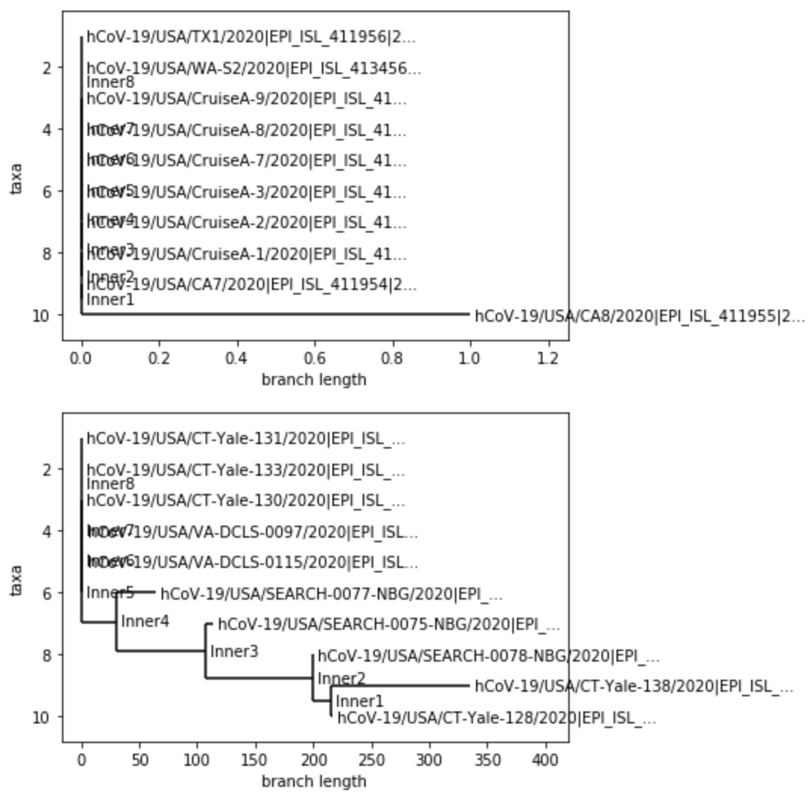
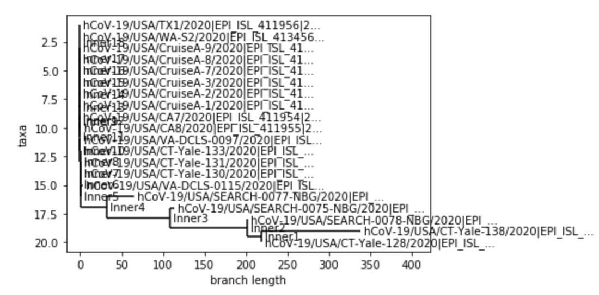

# <u>Week 1</u>

This week will be focused on looking at websites to give a brief intro to COVID-19

### GISAID

GISAID, also known as Global Initiative on Sharing All Influenza Data, is an online resource that helps give easy public access to not only data related to the flu, but also data concerning the corona virus. This site will be very helpful in acquiring different COVID-19 genome sequences to analyze. 

### Folding@Home

Folding@Home is a distributed computing project for simulation protein dynamics, including the process of protein folding and the movements of proteins in diseases. To help in the COVID-19 efforts, the site is dedicating more and more of its resources to understanding how the corona virus proteins work and how they can design therapeutics to stop the proteins. I believe that this site will provide different corona virus simulation which will give us some insight into how it works. 

### NextStrain

NextStrain appears to be a site that can provide great data on COVID-19. It contains a detailed phylogeny of COVID-19, showing over 3000 sampled genomes, and it also has a graph depicting the transmissions of corona virus across the globe to different nations. You also have the ability to see where it spread to at the start of the outbreak.

### MRA.ASM 

This site is basically a published article by the American Society for Microbiology that reports a complete genome sequence of a COVID-19 strain isolated in Nepal. After trying to read the article, I can safely say that they use some high level biology techniques to sequence the genome. 

### GalaxyProject

Galaxy Project is a site dedicated to providing best practices and workflows for analyzing COVID-19 data. The only three types of analyses that they feature are genomics, evolution, and cheminformatics. They also provide open source tools for anaylzing data sets. I think this site will be really useful in providing a framework for us to use in analyzing our COVID-19 data.

# <u>Week 2</u>

This week, I wanted to use phylogenic trees to get an idea of how much variation can found in the most current collected 
covid-19 genome sequences compared the genome sequences found near the beginning of the outbreak in the U.S.. To do this,
I took 10 of the most current covid-19 genome sequences and 10 of the earliest sequences that I could find in the U.S. from the
GISAID database. I compared each of them to a SARS-CoV-2 reference spike protein, and created phylogenies for each collection 
of sequences as well as a phylogeny for a combination of the two categories of sequences. Below are the phylogenies that I 
created:

The first tree shows the early sequences compared against the reference protein. The second tree shows the recent sequences 
compared against the reference. The third one is a combination of both, and much harder to read because of how clustered it is.
But, when looking at the first chart, I was surprised to see how little variation the early sequences had. Out of 10, only one 
sequence showed a 1 nucleuotide difference. I was even more surprised to see the recent sequence tree. A few of the samples held 
a huge number of variations. This one of two things. With how fast the virus has spread and multiplied, the virus has mutated 
quite rapidly, which could make finding a vaccine difficult. Or, there could be a problem with my data. The sequences that I 
downloaded were very recent, and it's quite possible that the sequences might not have been complete. Of course, I will 
check this out and update this entry.

To view what I did in more detail, here is my notebook: [My jupynotebook](./Project2.ipynb)

# <u>Week 3</u>

