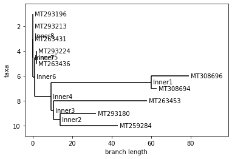
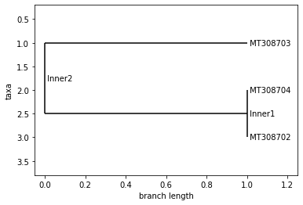

## Project Part 1 (a.k.a. Project 1 on Schedule)
We don't know enough bioinformatics yet, but we can start the project by cleaning up and improving your individual websites. For Project 1, I want you to read and summarize/synthesize/discuss the following links on your own pages within the main project repo. This is definitely less of a "for grade" assignment. There is a pandemic, and I believe we can contribute meaningful bioinformatics analysis. That starts with a review of currently available resources. Please use my links as a starting point, but post more links on Slack for others. Find more links. Together we can make a contribution. Here are the links that you should investigate at a minimum.

1. I need your GitHub username, you should be able to pull, but I need to add you in order to have write permissions <a href="https://forms.gle/L3n2ytZiht11BXqU8">https://forms.gle/L3n2ytZiht11BXqU8</a>
2. https://www.gisaid.org/
3. https://foldingathome.org/
4. https://nextstrain.org/ncov
5. https://mra.asm.org/content/9/11/e00169-20
6. https://covid19.galaxyproject.org/
7. https://unanimous.ai/what-is-si/
8. https://covidtracking.com/api


### Link to clone the repository
Here is a link to the project repository.

https://github.com/anderson-github-classroom/csc-448-project

The website can be viewed at https://anderson-github-classroom.github.io/csc-448-project/.


https://www.gisaid.org/

This site contains the genetic epidimeology of COVID-19, and the genetic sequences for all strains of the virus that have been detected. This will be really useful when we learn more about gene sequences and analyzing them.


https://foldingathome.org/

A lot of diseases are caused by proteins folding incorrectly. Understanding why this happens can help us combat viruses like COVID-19 and other diseases. As Folding at Home describes it, the proteins start at an initial position and then move in various ways to create different shapes. Visualizing this requires a lot of distributed computing power, so Folding at Home requests users to let them use thie unused processing power. However, I was intrigued by the way proteins fold, and how various data points about the proteins initial and final structure can provide a glimpse into how they fold. I know a company in San Luis Obispo, called UnanimousAI, that uses something called "swarm technology" to aggregate various, seemingly insignificant data points, into larger metrics and trends. The Folding at Home website literally described folding proteins as a football game where you only know the initial positions of the players, and you have to predict the result. Unanimous AI literally does this for sports betting, where they take data points from the start of the game and use it to predict the outcome. They've had phenomal success predicting the results of such races. Here's a link to their work: https://unanimous.ai/what-is-si/


https://nextstrain.org/ncov
    
Next Strain is a very nifty data visualization dashboard that tracks the phenology of the virus (aka, it's evolution over time). You can see how the virus mutates and spreads over the course of time with various visualizations. Each strain on the dashboard provides a GISAID ID number, which allows you to view the gene sequence for that particular strain on gisaid.org


https://mra.asm.org/content/9/11/e00169-20
    
This paper is unique because it contains the complete genome sequence from someone from Wuhan, which is the origin of the virus.


https://covid19.galaxyproject.org/
    
This site contains existing open-source research and infrastructure built on the virus. The website is split intwo three sections: genomics (raw and complete sequences), evolution (positions adapted to positive vs. negative selection -- about 5 positions right now are said to be positively selected) and cheminformatics (nonstructural proteins vital to continue the life cycle of COVID)


https://covidtracking.com/api
    
This is an API endpoint I found where we can ping for COVID-19 data directly instead of having to rely on scraping, imports, etc. 


## Project Part 3 (a.k.a. Project 3 on Schedule)
For project 3, I would like you to continue working on your project 2 line of investigation OR pivot to something different depending on your results or understanding or feedback on project 2. I will work to review project 2 submissions this week, so I can provide more individualized feedback as well as extract some highlights.

### Guidance (i.e., what you should do)
We've said many times. This project isn't about everyone reaching the same point in a predetermined set of steps. It's about applying what we are learning in class to produce real data analysis for the community. It is about as *Learn by doing* as you could possibly get at Cal Poly. So what should you be doing this week for the project? Here is some guidance (but remember this is only to guide you and not box you into specific tasks). They are in no particular order. 
* Consider what questions we want to ask from our evolutionary tree analysis. Think about what questions the book was trying to answer. Do we even have the data in this notebook to answer some of those questions? If not, spend time trying to find it now that you can know more about what to look for in terms of format. Do some literature searching and see what other work has been done for this virus and others.
* Research and try different evolutionary tree programs/frameworks. What I've done below is not the only game in town by far. Biopython itself has different options.
* Consider the alignment itself. Are there different ways to do this? Did we do it correctly?
* What about the sequences themselves? Are they all of the same quality? Should we exclude some?
* What about the virus alignment program? Did we use that correctly? Should we have done the entire sequence instead of using Spike as a reference? Should we try a different reference. 
* Do we have more data available about the sequences? Part of world, etc. Can we do some digging here to answer different questions.
* And I'm sure you can think of more to attempt... Think about what you want to do. Spend time working towards a well thoughtout goal. Document things as you go. Talk to everyone on Slack. Together we can do this!

### Link to clone the repository
Here is a link to the project repository.

https://github.com/anderson-github-classroom/csc-448-project

The website can be viewed at https://anderson-github-classroom.github.io/csc-448-project/.

### First step is to get the data
We are going to rely on the Galaxy team to pull together our sequence data for now. We might change this later.


```python
#import wget

#url = 'https://covid19.galaxyproject.org/genomics/4-Variation/current_complete_ncov_genomes.fasta'
#file = 'current_complete_ncov_genomes.fasta'
#wget.download(url, file)
```

### Virus Alignment
We will use a program specific for viral multiple alignments: https://github.com/rega-cev/virulign-tutorial

https://academic.oup.com/bioinformatics/article/35/10/1763/5123354

I downloaded the Mac binary and put it /Users/panderson/


```python
#!/Users/richagadgil/Desktop/CSC448/csc-448-project/students/rgadgil
```

I also downloaded the tutorials and the program repository.


```python
#!git clone https://github.com/rega-cev/virulign-tutorial 
```


```python
#!git clone https://github.com/rega-cev/virulign 
```

### Before alignment
As we mentioned in class, we need an alignment so we can derive our pairwise distance scores so we can then put together our distance matrix.

This package contains a reference Spike protein that can be provided as an argument when performing alignment. This code took my computer a few minutes to run, so I've included the output in the project repository: csc-448-project/data/position_table.csv.


```python
#!virulign-1/references/SARS-CoV-2/S.xml current_complete_ncov_genomes.fasta --exportAlphabet Nucleotides --exportKind PositionTable > position_table.csv
```


```python
#!virulign virulign-1/references/SARS-CoV-2/S.xml sequences.fasta --exportAlphabet Nucleotides --exportKind PositionTable > metadata_table.csv
```

### Read the data into a pandas dataframe


```python
import pandas as pd
position_table = pd.read_csv('../../data/position_table.csv') # or put in the path to csc-448-project/data/position_table.csv
```


```python
position_table
```


<div>
<style scoped>
    .dataframe tbody tr th:only-of-type {
        vertical-align: middle;
    }

    .dataframe tbody tr th {
        vertical-align: top;
    }

    .dataframe thead th {
        text-align: right;
    }
</style>
<table border="1" class="dataframe">
  <thead>
    <tr style="text-align: right;">
      <th></th>
      <th>seqid</th>
      <th>S_1_1</th>
      <th>S_1_2</th>
      <th>S_1_3</th>
      <th>S_2_1</th>
      <th>S_2_2</th>
      <th>S_2_3</th>
      <th>S_3_1</th>
      <th>S_3_2</th>
      <th>S_3_3</th>
      <th>...</th>
      <th>S_1270_3</th>
      <th>S_1271_1</th>
      <th>S_1271_2</th>
      <th>S_1271_3</th>
      <th>S_1272_1</th>
      <th>S_1272_2</th>
      <th>S_1272_3</th>
      <th>S_1273_1</th>
      <th>S_1273_2</th>
      <th>S_1273_3</th>
    </tr>
  </thead>
  <tbody>
    <tr>
      <th>0</th>
      <td>MT007544.1</td>
      <td>A</td>
      <td>T</td>
      <td>G</td>
      <td>T</td>
      <td>T</td>
      <td>T</td>
      <td>G</td>
      <td>T</td>
      <td>T</td>
      <td>...</td>
      <td>A</td>
      <td>C</td>
      <td>A</td>
      <td>T</td>
      <td>T</td>
      <td>A</td>
      <td>C</td>
      <td>A</td>
      <td>C</td>
      <td>A</td>
    </tr>
    <tr>
      <th>1</th>
      <td>MT019529.1</td>
      <td>A</td>
      <td>T</td>
      <td>G</td>
      <td>T</td>
      <td>T</td>
      <td>T</td>
      <td>G</td>
      <td>T</td>
      <td>T</td>
      <td>...</td>
      <td>A</td>
      <td>C</td>
      <td>A</td>
      <td>T</td>
      <td>T</td>
      <td>A</td>
      <td>C</td>
      <td>A</td>
      <td>C</td>
      <td>A</td>
    </tr>
    <tr>
      <th>2</th>
      <td>MT019530.1</td>
      <td>A</td>
      <td>T</td>
      <td>G</td>
      <td>T</td>
      <td>T</td>
      <td>T</td>
      <td>G</td>
      <td>T</td>
      <td>T</td>
      <td>...</td>
      <td>A</td>
      <td>C</td>
      <td>A</td>
      <td>T</td>
      <td>T</td>
      <td>A</td>
      <td>C</td>
      <td>A</td>
      <td>C</td>
      <td>A</td>
    </tr>
    <tr>
      <th>3</th>
      <td>MT019531.1</td>
      <td>A</td>
      <td>T</td>
      <td>G</td>
      <td>T</td>
      <td>T</td>
      <td>T</td>
      <td>G</td>
      <td>T</td>
      <td>T</td>
      <td>...</td>
      <td>A</td>
      <td>C</td>
      <td>A</td>
      <td>T</td>
      <td>T</td>
      <td>A</td>
      <td>C</td>
      <td>A</td>
      <td>C</td>
      <td>A</td>
    </tr>
    <tr>
      <th>4</th>
      <td>MT019532.1</td>
      <td>A</td>
      <td>T</td>
      <td>G</td>
      <td>T</td>
      <td>T</td>
      <td>T</td>
      <td>G</td>
      <td>T</td>
      <td>T</td>
      <td>...</td>
      <td>A</td>
      <td>C</td>
      <td>A</td>
      <td>T</td>
      <td>T</td>
      <td>A</td>
      <td>C</td>
      <td>A</td>
      <td>C</td>
      <td>A</td>
    </tr>
    <tr>
      <th>...</th>
      <td>...</td>
      <td>...</td>
      <td>...</td>
      <td>...</td>
      <td>...</td>
      <td>...</td>
      <td>...</td>
      <td>...</td>
      <td>...</td>
      <td>...</td>
      <td>...</td>
      <td>...</td>
      <td>...</td>
      <td>...</td>
      <td>...</td>
      <td>...</td>
      <td>...</td>
      <td>...</td>
      <td>...</td>
      <td>...</td>
      <td>...</td>
    </tr>
    <tr>
      <th>672</th>
      <td>MT334544.1</td>
      <td>A</td>
      <td>T</td>
      <td>G</td>
      <td>T</td>
      <td>T</td>
      <td>T</td>
      <td>G</td>
      <td>T</td>
      <td>T</td>
      <td>...</td>
      <td>A</td>
      <td>C</td>
      <td>A</td>
      <td>T</td>
      <td>T</td>
      <td>A</td>
      <td>C</td>
      <td>A</td>
      <td>C</td>
      <td>A</td>
    </tr>
    <tr>
      <th>673</th>
      <td>MT334546.1</td>
      <td>A</td>
      <td>T</td>
      <td>G</td>
      <td>T</td>
      <td>T</td>
      <td>T</td>
      <td>G</td>
      <td>T</td>
      <td>T</td>
      <td>...</td>
      <td>A</td>
      <td>C</td>
      <td>A</td>
      <td>T</td>
      <td>T</td>
      <td>A</td>
      <td>C</td>
      <td>A</td>
      <td>C</td>
      <td>A</td>
    </tr>
    <tr>
      <th>674</th>
      <td>MT334547.1</td>
      <td>A</td>
      <td>T</td>
      <td>G</td>
      <td>T</td>
      <td>T</td>
      <td>T</td>
      <td>G</td>
      <td>T</td>
      <td>T</td>
      <td>...</td>
      <td>A</td>
      <td>C</td>
      <td>A</td>
      <td>T</td>
      <td>T</td>
      <td>A</td>
      <td>C</td>
      <td>A</td>
      <td>C</td>
      <td>A</td>
    </tr>
    <tr>
      <th>675</th>
      <td>MT334557.1</td>
      <td>A</td>
      <td>T</td>
      <td>G</td>
      <td>T</td>
      <td>T</td>
      <td>T</td>
      <td>G</td>
      <td>T</td>
      <td>T</td>
      <td>...</td>
      <td>A</td>
      <td>C</td>
      <td>A</td>
      <td>T</td>
      <td>T</td>
      <td>A</td>
      <td>C</td>
      <td>A</td>
      <td>C</td>
      <td>A</td>
    </tr>
    <tr>
      <th>676</th>
      <td>MT334561.1</td>
      <td>A</td>
      <td>T</td>
      <td>G</td>
      <td>T</td>
      <td>T</td>
      <td>T</td>
      <td>G</td>
      <td>T</td>
      <td>T</td>
      <td>...</td>
      <td>A</td>
      <td>C</td>
      <td>A</td>
      <td>T</td>
      <td>T</td>
      <td>A</td>
      <td>C</td>
      <td>A</td>
      <td>C</td>
      <td>A</td>
    </tr>
  </tbody>
</table>
<p>677 rows × 3820 columns</p>
</div>


```python
from Bio import Phylo
from Bio.Phylo.Consensus import *
import numpy as np
from Bio.Phylo.TreeConstruction import DistanceMatrix
from Bio.Phylo.TreeConstruction import DistanceTreeConstructor

def print_trees(country, position_table):
    ### Pull out the concensus sequence

    concensus_seq = position_table.drop('seqid',axis=1).mode(axis=0).T[0]
    concensus_seq

    position_table = position_table.set_index('seqid')

    ### Determine which samples are farthest from the concensus sequence

    distance_from_concensus_seq = position_table.apply(lambda row: sum(row != concensus_seq),axis=1)
    distance_from_concensus_seq_sorted = distance_from_concensus_seq.sort_values(ascending=False)
    distance_from_concensus_seq_sorted

    ### Select 10 sequences to do our first analysis

    subset_seqs = distance_from_concensus_seq_sorted[:10].index
    subset_seqs

    ### Construct a distance matrix for our sequences

    distances = {}
    for i,seqid1 in enumerate(subset_seqs):
        distances[seqid1,seqid1]=0
        for j in range(i+1,len(subset_seqs)):
            seqid2 = subset_seqs[j]
            distances[seqid1,seqid2] = sum(position_table.loc[seqid1] != position_table.loc[seqid2])
            distances[seqid2,seqid1] = distances[seqid1,seqid2]
    distances = pd.Series(distances).unstack()
 
    matrix = np.tril(distances.values).tolist()
    for i in range(len(matrix)):
        matrix[i] = matrix[i][:i+1]
    dm = DistanceMatrix(list(distances.index), matrix)

    ### Now construct our tree
    constructor = DistanceTreeConstructor()
    tree = constructor.nj(dm)
    print(country.upper())
    print("Neighbor Joining Tree")
    tree.ladderize()   # Flip branches so deeper clades are displayed at top
    display(Phylo.draw(tree))
    #**Please see the guidance at the top of the page for what to try**

    if(len(dm) > 1):
        tree2 = constructor.upgma(dm)
        #Construction of a distance tree using clustering with the Unweighted Pair Group Method with Arithmatic Mean (UPGMA) -- stepwise differences
        print("UPGMA Tree")
        tree2.ladderize()   # Flip branches so deeper clades are displayed at top
        display(Phylo.draw(tree2))
        return


    # Other experimental Trees
    #trees = [tree, tree2]
    #target_tree = trees[0]
    #support_tree = get_support(target_tree, trees)

    #Phylo.draw(support_tree)

    #strict_tree = strict_consensus(trees)
    #majority_tree = majority_consensus(trees, 0.5)
    #adam_tree = adam_consensus(trees)

    #Phylo.draw(strict_tree)

    #Phylo.draw(majority_tree)

    #Phylo.draw(adam_tree)

```


```python
# Print Phylogenic Trees per Country
new_pos_table = position_table
new_pos_table['seqid'] = new_pos_table['seqid'].apply(lambda x: x.split(".")[0]).dropna()

metadata_df = pd.read_csv('sequences.csv')
countries = set([str(i).split(":")[0] for i in metadata_df['Geo_Location'].values])

for country in countries:
    country_accessions = metadata_df[metadata_df['Geo_Location'].str.contains(country, na=False)]
    new_table = new_pos_table[new_pos_table['seqid'].isin(country_accessions['Accession'].values)]
    if(len(new_table) > 0):
        print_trees(country, new_table)

```

    BRAZIL
    Neighbor Joining Tree


     


    TAIWAN
    Neighbor Joining Tree


     


    UPGMA Tree


     


    VIET NAM
    Neighbor Joining Tree


     


    UPGMA Tree


     


    TURKEY
    Neighbor Joining Tree


     


    GREECE
    Neighbor Joining Tree


     


    UPGMA Tree


     


    AUSTRALIA
    Neighbor Joining Tree


     


    SOUTH KOREA
    Neighbor Joining Tree


     


    UPGMA Tree


     


    NAN
    Neighbor Joining Tree


     


    SOUTH AFRICA
    Neighbor Joining Tree


     


    USA
    Neighbor Joining Tree





     


    UPGMA Tree


     


    SWEDEN
    Neighbor Joining Tree


     


    NEPAL
    Neighbor Joining Tree


     


    ISRAEL
    Neighbor Joining Tree


     


    UPGMA Tree


     


    SPAIN
    Neighbor Joining Tree


     


    UPGMA Tree


     


    ITALY
    Neighbor Joining Tree


     


    UPGMA Tree


     


    FRANCE
    Neighbor Joining Tree


     


    IRAN
    Neighbor Joining Tree


     


    CHINA
    Neighbor Joining Tree


     


    UPGMA Tree


     


    PERU
    Neighbor Joining Tree


     


    INDIA
    Neighbor Joining Tree


     


    UPGMA Tree


     


    PAKISTAN
    Neighbor Joining Tree


     


    UPGMA Tree


     


```python
metadata_df = pd.read_csv('sequences.csv')

collection_dates = list(set([i for i in metadata_df['Collection_Date'].values]))
collection_dates.remove(np.nan)
collection_dates = list(set([i.split("-")[0]+"-"+i.split("-")[1] for i in collection_dates if len(i.split("-")) == 3]))
collection_dates.sort()


for date in collection_dates:
    curr_date = metadata_df[metadata_df['Collection_Date'] == date]
    new_table = new_pos_table[new_pos_table['seqid'].isin(curr_date['Accession'].values)]
    if(len(new_table) > 0):
        print_trees(date, new_table)
```

    2020-01
    Neighbor Joining Tree


     


    2020-02
    Neighbor Joining Tree


     


    2020-03
    Neighbor Joining Tree


     


    UPGMA Tree


     


    2020-04
    Neighbor Joining Tree


     


    UPGMA Tree





     


```python
# TO DO: Add time series data 
```


```python

```


```python

```


```python

```


```python

```


```python

```


```python

```
