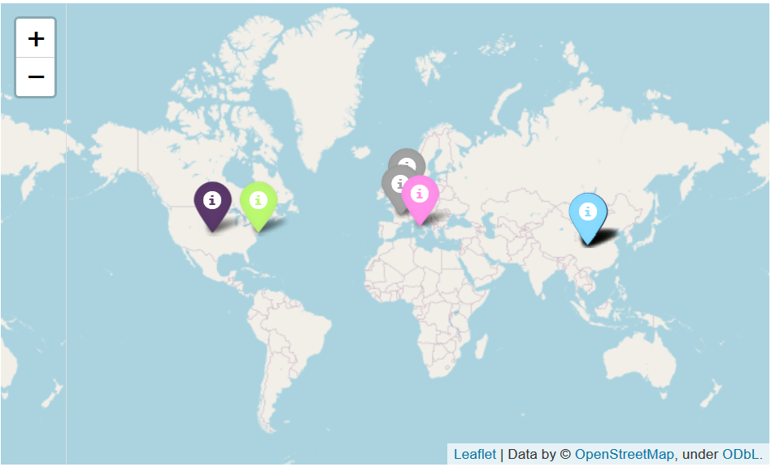

# Week 1
## The GISAID Initiative
### https://www.gisaid.org/about-us/mission/

GISAID is a non-profit initiative recognized by the European Commission as a parter in the PREDEMICS (Prepardness, Prediction and the Prevention of Emerging Zoonotic Viruses with Pandemic Potential) consortium. As such, their research regarding COVID19 has been multinational and exhaustive. A number of the following sources utilize GISAID data in their own analysis, emphasizing its importance in the field of bio-informatics. At the time of writing, they have a total of 8,001 genomes sequenced regarding hCoV-19. Unlike conventional archives, after curation, genome sequences are released to the public immediately. 

## Folding @ Home Project
### https://foldingathome.org/

The Folding @ Home Project is based in St. Louis at the Washington University in St. Louis School of Medicine. Their research investigates the protein folds in human cells which are integral to ensuring proper cell functionality. Misfolds in these proteins can result in serious alterations of functionality, possibly introducing serious health complications. Regaring COVID19, Folding @ Home is using computer simulations to understand the viral proteins found in instances of COVID19. Users can donate their own computing power to the research of these folds by visiting the URL above. 

## Next Strain
### https://nextstrain.org/ncov

Next Strain aggregates data into a tree-based representation of the fluctuation of COVID19 as it spreads into new territories. The distance of a particular node from the root correlates with the number of mutations of that particular instance of COVID19. The default view shows 3414 genomes but far more can be viewed if the user narrows the time/geographical ranges. The parent site, nextstrain.org, contains a plethora of data and analysis from a broad range of international sources. Analyses and reports can be found for each datasource and genome.

## Complete Genome Sequence of a 2019 Novel Coronavirus (SARS-CoV-2) Strain Isolated in Nepal
### https://mra.asm.org/content/9/11/e00169-20

A complete genome sequence of an instance of COVID-19 can be viewed from the data embedded in this study. This particular strand originates from a 32-year old patient who contracted COVID-19 in Wuhan, China. He then travelled to Nepal where he was diagnosed and studied. Research on this full genome can help research the evolution of COVID-19 and aid in the development of vaccines and treatment. The data is readibly available for individual research.

## Best practices for the analysis of SARS-CoV-2 data: Genomics, Evolution, and Cheminformatics
### https://covid19.galaxyproject.org/

The Galaxy Project analyzes data from GISAID in order to investigate the genomics, evolution, and cheminformatics of COVID-19. The site uses open-source data-science tools to provide easily-modifiable templates and workflows for analysis on each of the fields above. These templates can be downloaded and modified easily, making best-practice tools available for public use.

# Week 2
## Relative Distance Analysis to Suggest Host of Transfer for COVID19

The successing cells load data from the NCBI Nucleotide database as a means of investigating the likely host that humans initally obtained COVID19 from. With a relatively small sample size of host species we can identify how significant the edit distance between the sequenced human genome and the sequenced bat genome, further bolstering the current theory that COVID19 was originally transferred from bats to humans. The human sample selected was intentionally an instance of COVID19, the rest were selected arbitrarily with the only requirement that the data sample be representative of the entire genome.

### Data Collection
I used a set amount of accessions from a varying source of hosts for my data set. The hosts were arbitrarily chosen from the NCBI nucleotide database.

```python
accessions = ["1798174254", "MN996532","NC_002306","KY566211" 
              ,"JF792617", "KM454473", "NC_017083", "KR061459","KF294357", 
              "NC_003045", "LN610099", "MH021175", "KF268339",
             "NC_003436"]
host_names = ["human", "bat", "feline", "feline2", 
              "rat", "duck", "rabbit", "swine", "mouse", 
              "bovine", "guinea fowl", "avial (Brazil)", "murine",
             "porcine"]
```

### Data Source
I used the Entrez subset of the Bio module for data collection. I used the nucleotide DB within the NCBI database list to obtain full nucleotide sequences of the above accessions.

```python
from Bio import Entrez
from Bio import SeqIO
handle = Entrez.efetch(db="nucleotide", id=accessions, rettype="gb", retmode="xml")

record = Entrez.read(handle)

handle.close()

```


This data was then placed into a blank pandas DataFrame in a 2D matrix.

```python
import pandas as pd
place_holder = []
for i in range (len(host_names)):
    place_holder.append([0 for j in range(len(host_names))])
print(place_holder)
D = pd.DataFrame(place_holder,index=host_names,columns=host_names)

D
```


The distances between nucleotides were computed using the python Levenshtein module. The standard Levenshtein distance algorithm was employed in this case. For large accession counts, this process can take a few minutes.

```python
from Levenshtein import *

for name_a in host_names:
    for name_b in host_names:  
        if name_a == name_b:
            continue
        if D[name_a][name_b] != 0 or D[name_b][name_a]:
            continue
        dist = distance(sequences[name_a], sequences[name_b])
        D.set_value(name_b,name_a, dist)


# Create a lower-triangular matrix
j = 0
as_num = D.to_numpy().tolist()
tri_dm = []
for j in range(len(as_num)):
    tri_dm.append(as_num[j][0: j + 1])
print(tri_dm)

D
```


Finally, I displayed the graph to showcase the evolutionary tree of the selected coronavirus sequences.

```python
%matplotlib inline

from Bio.Phylo.TreeConstruction import DistanceTreeConstructor, DistanceMatrix
from Bio import Phylo
constructor = DistanceTreeConstructor()
tree = constructor.nj(DistanceMatrix(names=host_names, matrix=tri_dm))
tree.ladderize() 
Phylo.draw(tree)
```


### Analysis
As you can see, the human and bat genomes feature a statistically significant lack of variation relative to the other coronavirus sequences selected. This claim is bolstered by the distance matrix as well which showcases just how similar the two host sequences are. The current theory on the transmissin of COVID19 suggests that the virus was first contracted by humans through contact with bats. This very simple demonstration reaches a similar conclusion, albeit with a relatively small sample size.

### Room for Improvement
There is ample room for improvement in this particular analysis. For starters, relatively few accessions were selected. A better approach would be to take a large, random sample from the set of hosts in the NCBI database that have entire coronavirus genomes sequenced. Additionally, sequencing and analyzing the entire genome may take into account insignificant variation that could otherwise be filtered by analyzing particular proteins. This introduces additional challenges, however, such as ensuring that each host has the same protein sequenced. Either way, this basic research covers a lot of the tools for analysis and data collection that will prove useful in the further analysis of COVID19 and future coronaviruses.

# Week 3
## Graphical Mapping of Relative Edit Distances
For this week's advancement to my project, I implemented a few python modules to present the relative edit distances of nucleotide sequences on a globe map using OpenStreetMap with pins colored based on their relative edit distances. More specifically, each color is associated with one set of siblings in the produced distance tree. Each point is then mapped based on the country of sampling in the NCBI database. Note that some of these samples were only specific to a particular country, so differentiating between large amounts of samples from "China" or "Italy" will require significantly more work. The Geopy module was used to find the coordinates of locations based upon the strings used to describe their locations in each NCBI entry. Often this was only a country, so one point may represent more than one data point. More work is required to support more colors and provide more clarity on what each dot represents, but this serves as a very basic template for future improvements.

### Extracting Location info from NCBI Samples
Quite a bit of additional information was required from the samples to allow for the mapping of pins. To do this, a some string splicing with the aid of python geography module allowed for the retrieval of coordinates from the 'country' field of the samples. This was the most specific location info available for the samples I used last week, some samples specified the state or city of its relative country. Further improvements would involve searching for a different data source that featured more specific geographical identifiers.

```python
from geopy.geocoders import Nominatim

geolocator = Nominatim()
locations = []

accession_data = {}

def getCountry(sample):
    s = sample[sample.index('country') + 32:]
    return s[:s.index("'")]

def getName(sample):
    s = sample[sample.index("GBQualifier_name': 'organism'") + 53:]
    return s[:s.index("'")]

all_names = []
x = -1
for r in record:
    x += 1
    lc = ""
    nm = str(x) + getName(str(r))
    all_names.append(nm)
    try:
        lc = getCountry(str(r))

    except:
        continue
    print(lc)
    
    location = geolocator.geocode(lc)        
    locations.append({'host':nm,'location':[location.latitude, location.longitude]})
        
locations
```

A couple samples had no location specified, thus a try-catch statement was implemented to skip over those location-less samples.

### Assignment of Colors by Parent

```python
unique_parents = {}
all_colors = [
    'red',
    'blue',
    'gray',
    'darkred',
    'lightred',
    'orange',
    'beige',
    'green',
    'darkgreen',
    'lightgreen',
    'darkblue',
    'lightblue',
    'purple',
    'darkpurple',
    'pink',
    'cadetblue',
    'lightgray',
    'black'
]

leaves = tree.get_terminals()
for leaf in leaves:
    parent = tree.get_path(leaf)[-2]
    if not parent in unique_parents:
        if len(all_colors) == 0:
            break
        unique_parents[parent] = all_colors.pop()
        
    for r in locations:
        if r["host"][0:35] == str(leaf)[0:35]:
            r["color"] = unique_parents[parent]
            break
locations
```

The above code colors the samples by their parent, samples with the same parent will receive the same coloration as their siblings. This is by computing a path to each leaf in the tree and grabbing the second to last node in this path. From this, colors are assigned from a list of default, supported colors for the pybio module. In the future I plan to add support to color more samples based on hex values.

```python
# Folium portion of the code
import folium

map2 = folium.Map()

for entry in locations:
    print(entry)
    if "color" in entry:
        folium.Marker(entry["location"],popup=entry["host"],
                     icon=folium.Icon(color=entry["color"])).add_to(map2)

map2
```

This code creates the map seen below. The map is interactable and each dot has a label that describes the title of the original sample. The coloring is done based off its relative lineage in the tree. Again, lots of improvements can be made to this and with better data and location information a more impressive presentation can be made.



### Room for Improvement
There is again quite a bit of room for improvement following this week's advancements. For starters, more specific geographical identifiers are very necessary. I will address this by searching for samples that have more descriptive location information attached to them--be it through NCBI or other sources. I will work with my peers to see if they have found any particularly significant samples that I could pull from. Additionally, more color options are necessary. I will address this by implementing a more powerful coloring function that will use randomized rgb values to create a broader array of colors. Lastly, more information is necessary within each tag to allow for a more interactive presentation. As it stands, only the title is available for each pin when clicked. I will address this by exploring more of the data attached to each sample in addition to finding online examples to pull inspiration from. All in all, I like the idea of this graphical approach and am excited to further develop upon it in the coming weeks.