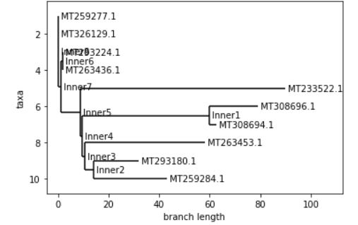
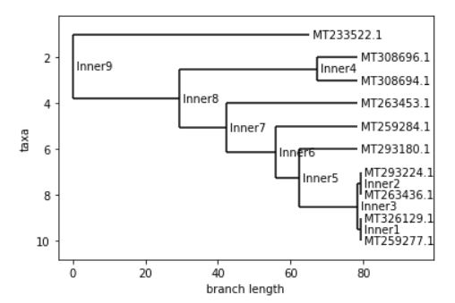

!---
permalink: /zwinger/
title: "Zachary Winger"
excerpt: "CSC 448 Bioinformatics Algorithms Project"
---

# Week 1

## 1. GISAID Initiative
GISAID, Global initiative on Sharing All Influenza Data, is a partnership between the intiative's administrative arm Freunde of GISAID, a non-profit, and the governments of Germany, Singapore, and the USA. The goal of GISAID is to provide a free, open-source location for people all over the world to share all influenza virus sequences, related data associated with human viruses, and data associated with avian and animal viruses. The initiative ensures this open-source access for all provided individuals identify themselves, and give proper credit to the source(s) of all data provided.

## 2. Folding@Home
Folding@Home is a distributed computing project whose purpose is to similate protein dynamics. The project relies on citizen scientists volunteering to run simulations of protein dynamics on their own computers to help create more data, faster to be used by scientists. Anyone is able to download the project and put help run the protein simulations.
The Folding@Home project aims to understand how proteins behave and use the simulations results to help develop theraputics. Since COVID-19 is a virus, and viruses have proteins, Folding@Home is hoping to use these simulations to better understand the virus to find a way to stop it.

## 3. Next Strain
NextStrain is a tool that displays the progression and spread of the coronavirus utilizing data provided through GISAID. Although it is known the COVID-19 pandemic began in Wuhan, China in November to December 2019, the exact transmission dates and spread of the virus are unclear. Sustained human-to-human interactions lead to the spread of the virus, which would explain the clear genetic relationships among the sampled viruses. The simulation shows only roughly 3000 genomes in a simgle view, but there are hundreds more complete genomes being found daily.

## 4. Microbiology Resource Announcements
A complete genome for the SARS-Cov-2 was obtained from a Nepalese patient. The patient aquired the infection in Wuhan, China, and traveled with it to Nepal. The patient was a 32-year-old male student at Wuhan University of technology in Wuhan, China, who returned to Nepal with a cough, mild fever, and throat congestion. The sequencing was done by using the Illumina MiSeq system with the Burrows-Wheeler Aligner MEM algorithm 0.7.5a-r405 assembly method. The sequence was put in the GenBank at the GISAID database.

## 5. Galaxy Project
The Galaxy Project's goal is to provide public access to infrastructure and workflowas for analying COVID-19 data. They focus on three types of data analysis, Genomics, Evolution, and Cheminformatics. The Genomics section discusses the sequencing of the virus. There are over 1,000 complete genomes on GISAID, but only a handful of raw sequencing read datasets. Galaxy project has found that there are 397 sites that show intra-host variation across 33 samples, and 29 have fixed differences at 39 sites from the published reference. The Eveolution section discusses analyzing which protions of the SARS-Cov-2 genome may be subject to positive or negative selection. Using data from GISAID, Galaxy Project uses comparative evolutionary techniques to analyze potential candidates. They have found about 5 genomic positions that may merit furhter invesitgation so far. The Cheminformatics section involves analyzing nonstructural proteins of SARS-Cov-2. Galaxy Project used protein-ligand docking to analyze and identify potentially inhibitory compounds that could be used to control viral proliferation. These compounds were chosen based on recently published X-ray crystal structures, with 500 high scoring compunds being identified.

# Week 2
The data I am using for analysis comes from https://covid19.galaxyproject.org/genomics/4-Variation/current_complete_ncov_genomes.fasta. This data set contains complete genomes of the SARS-Cov-2 virus. These sequences provided by GalaxyProject are sequences from patients from all over who have contracted SARS-Cov-2. 

In order to be able to use this data in any meaninful way, I needed to first perform multiple sequence alignment on it. Multiple sequence alignment is a way of arranging a biological sequence to help identify regions of similarity, and is done using multiple biological sequences. In order to perform multiple sequence alignment, I used the program virulign from https://github.com/rega-cev/virulign. Multiple sequence alignment of viral genes can be tricky due to the sensitivity to noise in the data many algorithms have; such noise coming from mutations, insertions, and deletions in the sequences. However virulign attempts to overcome some of this sensitivty by allowing for a reference sequence to be used during alignment. This ability to use a reference sequence to guide alignment allows virulign to perform better than more traditional multiple sequence alignent algorithms. Virulign can accept any reference sequence, but also contains reference sequences for various viral genes by default, including sequences for SARS-Cov-2. 

When performing alignment, I decided to use the provided Spike protein sequence as the reference to virulign so the program could use it as a guide when performing the alignment and try to correct for some noise that may be present in my data. The Spike protein sequence was not the only sequence I could have used for reference during alignment of the SARS-Cov-2 genomes. Provided by virulign were many other reference gene sequences for SARS-Cov-2. Although these other sequences were accessible, I decided to focus on utilizing the Spike protein sequence. I did so because since the Spike protein plays a major role in how the virus infects healthy cells, and as such it seemed a good place to start for my analysis. I was also influenced by knowing when analysing SARS-Cov, researchers had success analyzing the Spike protein when trying to determine the origins of the virus. These other reference sequences could be useful for further analysis in the future, however, for the time being I will focus on performing multiple sequence alignment using the reference Spike protein.

Once I had generated the multiple sequence alignments for the sequenced genomes, I used virulign to create a distance matrix for the alignment. I could then use this distance matrix to create phylogenetic trees for the genomes provided by Galaxy Project. To create the trees, I utilized biopython. Since I was able to obtain a distance matrix from virulign, I used this along with biopython to create distance based phylogenetic trees for my data. I could have used biopython to generate the distance matrix as well, however, since virulign was already performing the multiple sequence alignment, I found it easier to have it create the distance matrix as well and then convert it into a biopython distance matrix at run time, which would not require any further calculations

```
#Create the distance matrix
!virulign references/SARS-CoV-2/S.xml current_complete_ncov_genomes.fasta --exportAlphabet Nucleotides --exportKind PositionTable > position_table.csv

# Create the multiple sequence alignment
!virulign references/SARS-Cov-2/S.xml current_complete_ncov_genomes.fasta --exportAlphabet Nucleotides --exportKind GlobalAlignment > alignment.fasta
```

## Distance Tree Construction
Biopython provides two ways of creating a distance based phylogenetic tree using distance matricies; the Neighbor Joining and Unweighted Pair Group Method with Arithmetic Mean (UPGMA) algorithms. Both types of algorithms allow for the construction of phylogenetic trees for both additive and non-additive distance matricies. In order to do so though, I needed to convert the distance matrix computed by virulign into a biopython distance matrix.

```
from Bio.Phylo.TreeConstruction import DistanceMatrix
from Bio.Phylo.TreeConstruction import DistanceTreeConstructor
from Bio import Phylo
import pandas as pd
import numpy as np

#Read in the postion table
position_table = pd.read_csv('../../data/position_table.csv')

#Find the distacne from the consensus_sequence for all sequences
concensus_seq = position_table.drop('seqid',axis=1).mode(axis=0).T[0]
position_table = position_table.set_index('seqid')
distance_from_concensus_seq = position_table.apply(lambda row: sum(row != concensus_seq),axis=1)
distance_from_concensus_seq_sorted = distance_from_concensus_seq.sort_values(ascending=False)
subset_seqs = distance_from_concensus_seq_sorted[:10].index

#Construct the distance matrix
distances = {}
for i,seqid1 in enumerate(subset_seqs):
    distances[seqid1,seqid1]=0
    for j in range(i+1,len(subset_seqs)):
        seqid2 = subset_seqs[j]
        distances[seqid1,seqid2] = sum(position_table.loc[seqid1] != position_table.loc[seqid2])
        distances[seqid2,seqid1] = distances[seqid1,seqid2]
distances = pd.Series(distances).unstack()

#Convert to biopython distance matrix
matrix = np.tril(distances.values).tolist()
for i in range(len(matrix)):
    matrix[i] = matrix[i][:i+1]
dm = DistanceMatrix(list(distances.index), matrix)
```

### Neighbor Joining Tree
For the first tree I created, I used the Neighbor Joining algorithm from biopython. In order to simplify the tree I constructed, I limited the number of sequences used in its construction to the top 10 sequences with the furthest distance from the consensus sequence. In order to find the consensus sequence, I found the most common sequence in the multiple sequence alignment.

```
#Construct the NJ tree
constructor = DistanceTreeConstructor()
tree = constructor.nj(dm)

%matplotlib inline

tree.ladderize()   # Flip branches so deeper clades are displayed at top
Phylo.draw(tree)
```



### UPGMA Tree

The second tree I constructed utilized the UPGMA algorithm provded by biopython. As with the Neighbor Joining tree, I also limited the number of sequences used to only the 10 sequences furthest away from the consensus sequence and used the distance matrix computed using virulign.

```
#Construct the UPGMA tree
constructor = DistanceTreeConstructor()
tree = constructor.upgma(dm)

%matplotlib inline

tree.ladderize()   # Flip branches so deeper clades are displayed at top
Phylo.draw(tree)
```



## Parsimony Tree Construction
After creating distance based phylogenetic trees, I wanted to try creating a Parsimony tree. In order to keep the size of the tree managable, similar to what I did by limiting the number of sequences in the distance based trees, I selected the first 10 sequences in the multiple sequence alignment to create the tree from, selected manually at random; although the sample sequences were from patients from different areas of the world. In order to create the tree, I again utilized bioython, this time using the parsimony tree constructor class. 

```
from Bio import AlignIO
from Bio.Phylo.TreeConstruction import *
aln = AlignIO.read('alignments_cut_down.fasta', 'fasta')
stating_tree = None
scorer = ParsimonyScorer()
searcher = NNITreeSearcher(scorer)
constructor = ParsimonyTreeConstructor(searcher)
pars_tree = constructor.build_tree(aln)
Phylo.draw(pars_tree)
```

